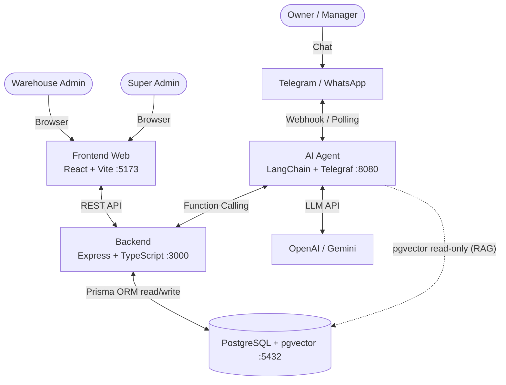

# Otomatisasi Warehouse Management System (WMS) dengan Asisten AI (RAG)

> Sistem manajemen gudang berbasis web yang terintegrasi **asisten AI (Retrieval-Augmented Generation)** melalui platform pesan instan (Telegram/WhatsApp) untuk UMKM distribusi _fast-moving goods_.


---

## Daftar Isi

- [Tentang Proyek](#tentang-proyek)
- [Fitur Utama](#fitur-utama)
- [Arsitektur Sistem](#arsitektur-sistem)
- [Tech Stack](#tech-stack)
- [Struktur Repositori](#struktur-repositori)
- [Dokumentasi](#dokumentasi)
- [Memulai (Quick Start)](#memulai-quick-start)
- [Contoh Penggunaan](#contoh-penggunaan)
- [Roadmap (5 Minggu)](#roadmap-5-minggu)
- [Pengujian](#pengujian)
- [Kontribusi](#kontribusi)
- [Lisensi](#lisensi)
- [Referensi](#referensi)

---

## Tentang Proyek

UMKM di sektor _fast-moving_ (seperti frozen food) memiliki perputaran barang masuk dan keluar yang sangat cepat setiap hari, sementara pencatatan sering masih manual atau tersebar di grup chat. Akibatnya timbul selisih stok, keputusan yang lambat, dan beban administratif berulang.

Proyek ini menghadirkan **WMS berbasis web** untuk staf admin gudang, yang dihubungkan dengan **asisten AI** bagi owner/manager. AI dapat membaca _database real-time_ dan mengeksekusi _workflow_ bisnis melalui bahasa natural di Telegram/WhatsApp — memisahkan _user experience_ sesuai peran: admin bekerja di dashboard web, owner cukup "chatting".

**Masalah yang diselesaikan:**

| Kode  | Masalah                          | Dampak                                             |
| :---- | :------------------------------- | :------------------------------------------------- |
| P-001 | Hambatan akses data (harus buka web) | Keputusan tertunda, data real-time tak dimanfaatkan |
| P-002 | _Human error_ pada volume tinggi  | Selisih stok, kerugian operasional                  |
| P-003 | Keterlambatan pengambilan keputusan | Kehilangan momentum bisnis                       |
| P-004 | Beban administratif repetitif      | Produktivitas staf turun                            |

---

## Fitur Utama

### 1. Dashboard WMS (Web) — untuk Admin Gudang

- **Master Data**: Produk (SKU, unit, kategori), Kategori, Partner (Supplier/Customer), Gudang (multi-gudang).
- **Transaksi Inventori**: Barang masuk (inbound) & barang keluar (outbound) dengan **stok dihitung otomatis**.
- **Purchase Order (PO)**: Alur `DRAFT → CONFIRMED → COMPLETED / CANCELLED`, penomoran otomatis.
- **Surat Jalan (Delivery Note)**: Dibuat dari PO, siap cetak/ekspor.
- **Dashboard & Laporan**: Ringkasan stok, transaksi harian, low-stock alert, rekap pengiriman.
- **Autentikasi & RBAC**: Peran `SUPER_ADMIN`, `ADMIN`, `OWNER`.
- **Audit Log**: Jejak perubahan data penting.

### 2. Asisten AI (Chat) — untuk Owner/Manager

- **Cek stok** — _"Berapa sisa stok Dimsum Ayam Ukuran Sedang?"_
- **Rekap pengiriman** — _"Kemarin tanggal 20 kita kirim ke mana saja?"_
- **Buat draft PO** — _"Besok siapkan PO untuk PT Maju Jaya isinya 50 pack Dimsum."_
- **Tanya SOP/knowledge** (RAG) — _"Apa SOP penerimaan barang retur?"_
- **Anti-halusinasi** — jawaban hanya dari data perusahaan/konteks RAG, bukan pengetahuan umum.
- **Intent-to-action** — perintah chat dapat memicu pembuatan draft PO di sistem.

---

## Arsitektur Sistem



| Service    | Port | Peran                                                                    |
| :--------- | :--- | :----------------------------------------------------------------------- |
| `frontend` | 5173 | Dashboard WMS (React + Vite + TanStack Query + Tailwind)                 |
| `backend`  | 3000 | REST API, logika bisnis, autentikasi, akses DB (read/write)              |
| `ai-agent` | 8080 | Chat bot, intent recognition, function calling, RAG retrieval (read-only) |
| `db`       | 5432 | PostgreSQL + ekstensi `pgvector`                                         |

> **Prinsip:** Backend adalah **satu-satunya penulis data bisnis**. AI Agent hanya mengakses data bisnis lewat Backend API dan diberi akses **read-only** ke tabel vector `document_chunks` (least privilege).

---

## Tech Stack

| Lapisan       | Teknologi                                                        |
| :------------ | :--------------------------------------------------------------- |
| **Frontend**  | React (Vite), TypeScript, Tailwind CSS, TanStack Query           |
| **Backend**   | Node.js (Express), TypeScript, Prisma ORM, Zod                   |
| **AI Agent**  | Node.js, TypeScript, LangChain.js, Telegraf                      |
| **Database**  | PostgreSQL + ekstensi `pgvector`                                 |
| **LLM**       | OpenAI (`gpt-4o-mini`) + `text-embedding-3-small`                |
| **Infra**     | Docker, Docker Compose                                           |

---

## Struktur Repositori

```text
inventory-rag/
├── docs/                                  # Dokumentasi proyek
│   ├── BRD.md                             # Business Requirements Document
│   ├── FSD.md                             # Functional Specification Document
│   ├── ERD.md                             # ERD & skema Prisma
│   └── TECHNICAL.md                       # Technical Design / build guide
├── backend/                               # REST API (Express + Prisma)        [dalam pengembangan]
├── frontend/                              # Dashboard WMS (React + Vite)       [dalam pengembangan]
├── ai-agent/                              # Chat bot + RAG (LangChain)         [dalam pengembangan]
├── docker-compose.yml                     # Orkestrasi 4 service
├── .gitignore
├── LICENSE
└── README.md
```

---

## Dokumentasi

Dokumen lengkap tersedia di folder [`docs/`](./docs):

| Dokumen                       | Deskripsi                                                        |
| :---------------------------- | :-------------------------------------------------------------- |
| [BRD](./docs/BRD.md)          | Latar belakang bisnis, masalah, objective, KPI, risiko          |
| [FSD](./docs/FSD.md)          | Functional requirements, use case, API, spesifikasi AI Agent    |
| [ERD](./docs/ERD.md)          | Entity Relationship Diagram + skema Prisma siap pakai           |
| [TECHNICAL](./docs/TECHNICAL.md) | Arsitektur teknis, struktur kode, env, pipeline RAG, panduan dev |

---

## Memulai (Quick Start)

### Prasyarat

- **Node.js** 20 LTS + **npm** 10+
- **Docker** 24+ & Docker Compose v2
- **Git**
- Akun **Telegram** (buat bot via [@BotFather](https://t.me/BotFather)) & **OpenAI API Key**

### 1. Clone & siapkan environment

```bash
git clone <repo-url> inventory-rag
cd inventory-rag

cp .env.example .env
cp backend/.env.example backend/.env
cp frontend/.env.example frontend/.env
cp ai-agent/.env.example ai-agent/.env
```

Isi variabel penting: `OPENAI_API_KEY`, `TELEGRAM_BOT_TOKEN`, `INTERNAL_API_KEY`, dan `JWT_*` (lihat [TECHNICAL §5](./docs/TECHNICAL.md)).

### 2. Jalankan database (PostgreSQL + pgvector)

```bash
docker compose up -d db
```

### 3. Backend

```bash
cd backend
npm install
npx prisma generate
npx prisma migrate dev --name init
npx prisma db seed
npm run dev         # http://localhost:3000
```

### 4. Frontend

```bash
cd frontend
npm install
npm run dev         # http://localhost:5173
```

### 5. AI Agent

```bash
cd ai-agent
npm install
npm run rag:ingest  # opsional: embed dokumen SOP ke document_chunks
npm run dev         # bot long-polling di http://localhost:8080
```

> **Alternatif:** jalankan seluruh stack sekaligus dengan `docker compose up --build`.

---

## Contoh Penggunaan

Berikut interaksi owner dengan asisten AI via Telegram:

```text
Owner : Berapa sisa stok Dimsum Ayam Ukuran Sedang?
Bot   : Stok Dimsum Ayam Ukuran Sedang (SKU: DMS-SDG-01) saat ini 120 pack.

Owner : Kemarin tanggal 20 kita kirim ke mana saja?
Bot   : Pengiriman 20 Sep:
        - PT Maju Jaya: 50x Dimsum Ayam Ukuran Sedang
        - Toko Berkah: 30x Nugget Ayam

Owner : Besok siapkan PO untuk PT Maju Jaya isinya 50 pack Dimsum.
Bot   : Draft PO PO-202609-001 untuk PT Maju Jaya (50 pack Dimsum) sudah
        dibuat dengan status DRAFT. Silakan konfirmasi di aplikasi web.

Owner : Apa SOP penerimaan barang retur?
Bot   : (dari knowledge base) Barang retur diverifikasi maksimal 1x24 jam...
```

---

## Roadmap (5 Minggu)

| Minggu | Fase                              | Target                                                                                   |
| :----- | :-------------------------------- | :--------------------------------------------------------------------------------------- |
| **1**  | Backend & DB                      | ERD final, init repo, Docker Compose, Prisma migrate + seed, Auth/RBAC, CRUD master data  |
| **2**  | Backend Transaksi + Frontend Dasar | Transaksi atomic stok, PO lifecycle, audit; setup Vite + Tailwind + TanStack Query, layout, UI master data |
| **3**  | Frontend Lanjutan + AI Dasar      | UI transaksi & PO + dashboard; setup ai-agent, Telegraf, tools cek stok & rekap pengiriman |
| **4**  | AI Lanjutan + RAG                 | Tool buat draft PO, RAG ingestion + retriever, tool cari SOP, sinkronisasi chat → web      |
| **5**  | Testing & Finalisasi              | E2E chat → PO → web, bug fixing, optimasi prompt, dokumentasi & demo                       |

---

## Pengujian

```bash
npm test           # unit + integration
npm run test:e2e   # e2e (opsional)
npm run lint
npm run typecheck
```

---

## Kontribusi

1. Buat branch fitur: `git checkout -b feat/nama-fitur`.
2. Gunakan [Conventional Commits](https://www.conventionalcommits.org/): `feat(scope): ...`, `fix(scope): ...`, `docs(scope): ...`.
3. Pastikan `npm run lint && npm run typecheck && npm test` lulus sebelum membuat PR.

---

## Lisensi

Proyek ini dilisensikan di bawah **MIT License** — lihat file [LICENSE](./LICENSE).

---

## Referensi

- **Panduan teknis lengkap:** [`docs/TECHNICAL.md`](./docs/TECHNICAL.md)
- **Dokumentasi proyek:** [`docs/`](./docs) (BRD, FSD, ERD)
