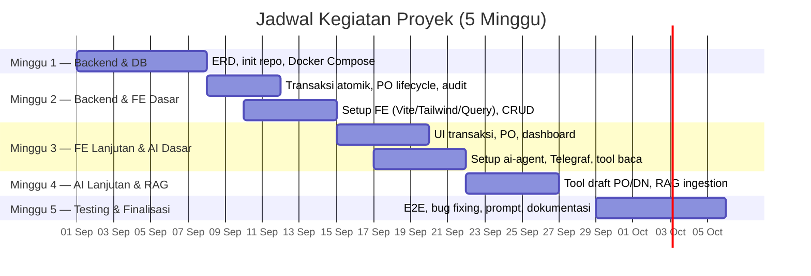
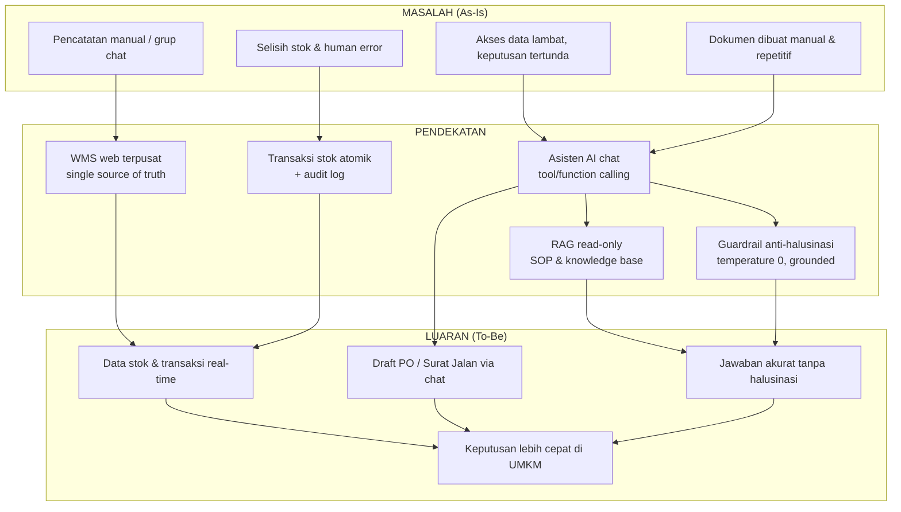
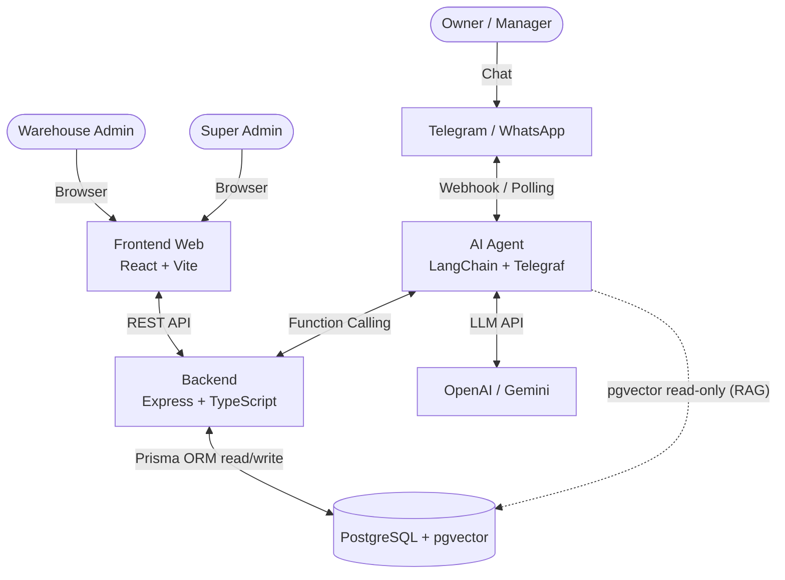
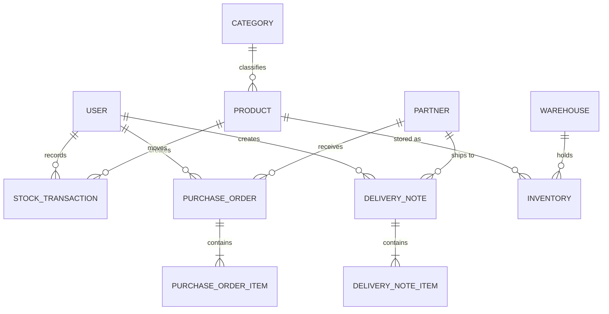
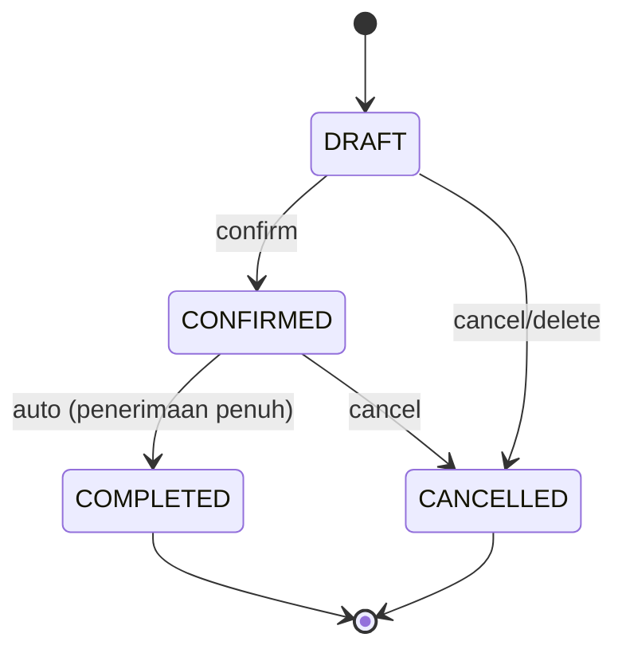
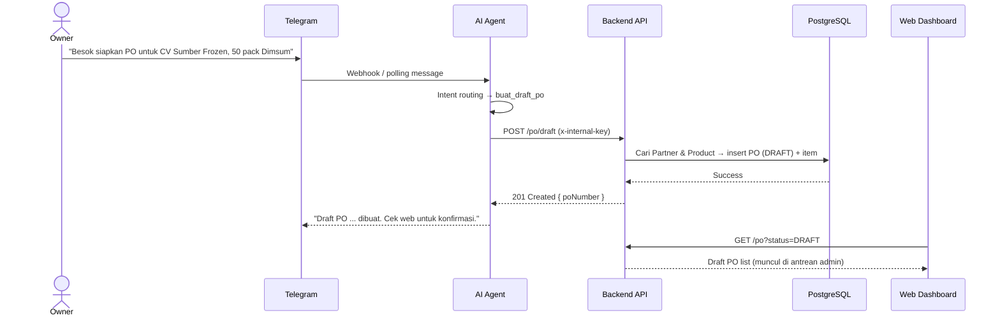
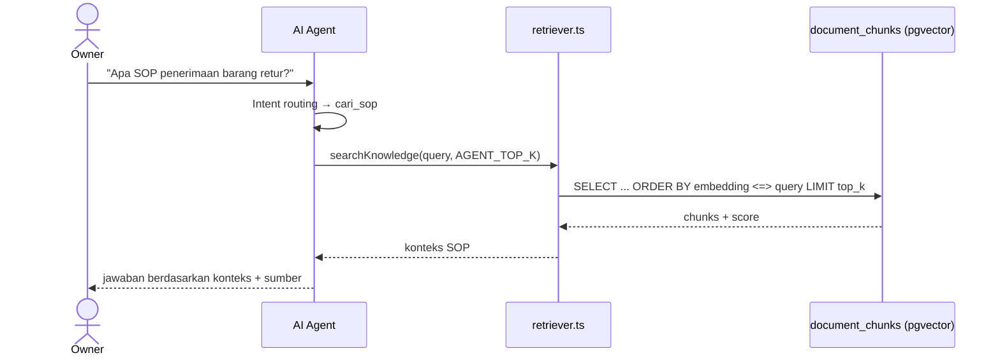

# Proposal Proyek

**Judul:** Otomatisasi Warehouse Management System (WMS) dan Tata Kelola Dokumen Berbasis Web dengan Integrasi Asisten AI (RAG) pada Platform Pesan Instan

**Jenis Dokumen:** Proposal / Laporan Proyek (Capstone)
**Versi:** 1.0.0
**Status:** Draft
**Penyusun:** [Nama Penyusun]
**Institusi/Program Studi:** [Nama Institusi / Program Studi]
**Pembimbing:** [Nama Pembimbing]
**Tanggal:** [Tanggal]

**Dokumen Terkait:** [BRD](./BRD.md) · [FSD](./FSD.md) · [ERD](./ERD.md) · [TECHNICAL](./TECHNICAL.md) · [README](../README.md)

---

## Daftar Isi

- [BAB I — PENDAHULUAN](#bab-i--pendahuluan)
  - [1.1 Latar Belakang](#11-latar-belakang)
  - [1.2 Tujuan](#12-tujuan)
  - [1.3 Ruang Lingkup](#13-ruang-lingkup)
  - [1.4 Jadwal Kegiatan](#14-jadwal-kegiatan)
- [BAB II — TINJAUAN PUSTAKA](#bab-ii--tinjauan-pustaka)
- [BAB III — METODOLOGI](#bab-iii--metodologi)
- [BAB IV — HASIL DAN PEMBAHASAN](#bab-iv--hasil-dan-pembahasan)
- [BAB V — KESIMPULAN DAN REKOMENDASI](#bab-v--kesimpulan-dan-rekomendasi)
- [BAB VI — LAMPIRAN](#bab-vi--lampiran)

---

# BAB I — PENDAHULUAN

## 1.1 Latar Belakang

Usaha Mikro, Kecil, dan Menengah (UMKM) merupakan tulang punggung perekonomian Indonesia, dengan kontribusi terhadap Produk Domestik Bruto (PDB) nasional dan penyerapan tenaga kerja yang sangat besar. Pada sektor distribusi barang *fast-moving* seperti *frozen food*, perputaran barang masuk dan keluar berlangsung sangat cepat setiap hari. Kondisi ini menuntut ketepatan pencatatan persediaan yang tinggi, karena selisih stok sekecil apa pun akan berakumulasi menjadi kerugian operasional.

Meskipun demikian, praktik pencatatan pada banyak UMKM masih dilakukan secara manual, menggunakan buku catatan, *spreadsheet* sederhana, atau bahkan tersebar di grup pesan instan. Pola kerja seperti ini rentan terhadap kesalahan manusia (*human error*), sulit direkonsiliasi, dan menimbulkan beban administratif yang berulang. Selain itu, pemilik usaha sering kali memiliki mobilitas tinggi dan tidak dapat dengan mudah membuka *dashboard* untuk sekadar mengecek sisa stok atau status pengiriman. Akibatnya, keputusan bisnis menjadi tertunda dan data *real-time* tidak dimanfaatkan secara optimal.

Tantangan adopsi teknologi pada UMKM juga bukan semata soal ketersediaan perangkat lunak. Sistem ERP/WMS yang canggih sering ditinggalkan karena dianggap "terlalu rumit" dan membutuhkan kurva pembelajaran yang tinggi. Tinjauan pustaka sistematis menunjukkan bahwa transformasi digital UMKM di Indonesia memang memberikan manfaat signifikan berupa perluasan pasar, efisiensi operasional, dan peningkatan profitabilitas, namun terhambat oleh keterbatasan sumber daya, keterampilan teknis, serta kebiasaan bisnis yang telah mengakar [4], [5]. Karena itu, dibutuhkan solusi yang menyatukan **data operasional terstruktur** dengan **antarmuka yang sudah familiar** bagi pengguna.

Perkembangan *Large Language Model* (LLM) membuka peluang baru untuk menjembatani kesenjangan tersebut. Melalui pola *tool/function calling*, model bahasa dapat dipandu untuk mengakses data perusahaan secara terkendali, bukan mengandalkan pengetahuannya sendiri [2], [3]. Dengan arsitektur *Retrieval-Augmented Generation* (RAG), jawaban model dapat *dibumikan* (grounded) pada sumber pengetahuan perusahaan sehingga menekan halusinasi [1], [9]. Pendekatan ini memungkinkan pemilik usaha cukup "mengobrol" untuk mengecek stok, merekap pengiriman, hingga membuat draft dokumen, sementara staf tetap bekerja pada *dashboard* web yang komprehensif.

Berdasarkan uraian tersebut, proyek ini mengusulkan pembangunan **sistem Warehouse Management System (WMS) berbasis web** yang terintegrasi dengan **asisten AI berbasis RAG** melalui platform pesan instan (Telegram, dengan WhatsApp sebagai tahap lanjut). Masalah yang diidentifikasi dan dampaknya dirangkum pada Tabel 1.1.

**Tabel 1.1 — Identifikasi Masalah**

| ID | Masalah | Deskripsi | Dampak Bisnis |
| :--- | :--- | :--- | :--- |
| P-001 | Hambatan akses data | Pemilik harus membuka laptop, login, dan memfilter tabel hanya untuk mengecek stok/status kirim. | Keputusan tertunda; data *real-time* tidak termanfaatkan. |
| P-002 | *Human error* pada volume tinggi | Pencatatan manual/grup chat rentan salah dan sulit direkonsiliasi. | Selisih stok, kehilangan barang, kerugian operasional. |
| P-003 | Keterlambatan keputusan | Tanpa data instan, pemilik ragu menerima pesanan besar. | Kehilangan momentum dan peluang bisnis. |
| P-004 | Beban administratif repetitif | Pembuatan dokumen harian (PO, Surat Jalan) menyita waktu staf. | Produktivitas menurun; biaya tenaga kerja tidak efektif. |
| P-005 | Adopsi teknologi rendah | Sistem ERP/WMS dianggap terlalu rumit bagi pengguna UMKM. | Investasi teknologi tidak menghasilkan ROI. |

**Akar masalah (root cause):** kesenjangan antara kompleksitas sistem dan kebiasaan komunikasi alami pengguna. Solusi yang diusulkan adalah menyediakan antarmuka yang familiar (chat) dengan *zero-learning-curve*, namun tetap terhubung ke data operasional yang terstruktur dan tervalidasi.

## 1.2 Tujuan

Tujuan umum proyek ini adalah merancang dan membangun sistem WMS berbasis web yang terintegrasi asisten AI RAG untuk membantu UMKM distribusi *fast-moving goods* mengelola persediaan dan dokumen secara terpusat, akurat, dan mudah diakses. Secara khusus, tujuan proyek dirumuskan pada Tabel 1.2.

**Tabel 1.2 — Tujuan Proyek**

| ID | Tujuan | Masalah yang Disasar |
| :--- | :--- | :--- |
| OBJ-1 | Menyediakan akses data inventori *real-time* kepada pemilik tanpa harus membuka *dashboard* web. | P-001, P-003 |
| OBJ-2 | Mengurangi selisih stok melalui pencatatan transaksi masuk/keluar terpusat dan tervalidasi. | P-002 |
| OBJ-3 | Mempercepat pembuatan dokumen (PO & Surat Jalan) melalui otomatisasi dan eksekusi via chat. | P-004 |
| OBJ-4 | Meningkatkan adopsi teknologi dengan antarmuka chat yang *zero-learning-curve*. | P-005 |
| OBJ-5 | Menyediakan laporan operasional harian yang andal untuk pengambilan keputusan. | P-001, P-003 |

Selain tujuan di atas, proyek menargetkan indikator keberhasilan (KPI) yang dapat diukur, sebagaimana Tabel 1.3.

**Tabel 1.3 — Indikator Keberhasilan (KPI)**

| ID | Metrik | Baseline | Target |
| :--- | :--- | :--- | :--- |
| KPI-1 | Waktu pemilik memperoleh info stok/pengiriman | > 5 menit (manual) | < 10 detik (chat) |
| KPI-2 | Selisih stok pada *stock opname* | ≥ 5% | ≤ 1% |
| KPI-3 | Waktu pembuatan draft PO | 5–10 menit | < 1 menit (via chat) |
| KPI-4 | Akurasi jawaban AI terhadap data aktual | N/A | 100% (dari basis data, tanpa halusinasi) |
| KPI-5 | Adopsi asisten chat oleh pemilik | 0% | ≥ 70% interaksi harian |

## 1.3 Ruang Lingkup

### 1.3.1 Termasuk dalam Ruang Lingkup (In-Scope)

1. **Aplikasi WMS berbasis web (untuk admin gudang):**
   - Manajemen data master: Produk (SKU, unit, kategori, stok minimum), Kategori, Partner (Supplier/Customer), dan Gudang (multi-gudang).
   - Transaksi **barang masuk (inbound)** dan **barang keluar (outbound)** dengan stok dihitung otomatis.
   - Manajemen **Purchase Order (PO)** dengan alur status `DRAFT → CONFIRMED → COMPLETED / CANCELLED` dan penomoran otomatis.
   - Manajemen **Surat Jalan / Delivery Note (DN)** untuk partner `CUSTOMER`, termasuk halaman detail, edit saat `DRAFT`, dan cetak.
   - *Dashboard* dan laporan operasional (stok, transaksi harian, *low-stock alert*, rekap pengiriman).
   - Autentikasi dan kontrol akses berbasis peran (**RBAC**): `SUPER_ADMIN`, `ADMIN`, `OWNER`.
   - **Audit log** untuk perubahan data penting.
2. **Asisten AI berbasis chat (untuk Owner/Manager), MVP Telegram:**
   - Intent baca: cek stok, katalog/varian produk, kategori, partner, gudang, transaksi masuk/keluar, rekap pengiriman, daftar/detail PO, surat jalan, stok tipis, dan ringkasan *dashboard*.
   - Intent tulis (hanya draft): buat draft PO (partner `SUPPLIER`) dan buat draft Surat Jalan (partner `CUSTOMER`).
   - Tanya SOP/kebijakan internal melalui **RAG** dari *knowledge base*.
   - *Guardrail* anti-halusinasi dan pencatatan percakapan untuk audit.
3. **Backend REST API terpusat** sebagai satu-satunya penulis data bisnis dan sumber logika bisnis.
4. **Deployment berbasis container** (Docker Compose) yang dapat dijalankan ulang di Linux/WSL2/VPS.

### 1.3.2 Di Luar Ruang Lingkup (Out-of-Scope)

| Item | Alasan |
| :--- | :--- |
| Modul akuntansi/jurnal keuangan | Fokus pada operasional gudang. |
| Payroll & HR | Di luar domain inventori. |
| Multi-tenant SaaS / multi-perusahaan | Diasumsikan satu perusahaan (*single tenant*). |
| Aplikasi mobile native (Android/iOS) | Antarmuka mobile diwakili oleh chat. |
| Integrasi EDI / marketplace / *e-invoice* | Kompleksitas integrasi eksternal di luar cakupan. |
| *Demand forecasting* / ML prediktif | Fitur lanjutan pasca-MVP. |
| WhatsApp sebagai kanal utama | MVP memakai Telegram; WhatsApp tahap lanjut. |

## 1.4 Jadwal Kegiatan

Proyek direncanakan selesai dalam **lima minggu** dengan pendekatan sprint mingguan. Prioritas awal diberikan pada unsur kebaruan (*novelty*) — integrasi AI RAG — agar risiko keterlambatan dapat dikelola. Rencana kegiatan disajikan pada Tabel 1.4 dan divisualisasikan pada Gambar 1.1.

**Tabel 1.4 — Rencana Kegiatan (5 Minggu)**

| Minggu | Fase | Target |
| :--- | :--- | :--- |
| **1** | Backend & Basis Data | ERD final, inisialisasi repositori, Docker Compose, Prisma migrate + seed, Auth/RBAC, CRUD master data. |
| **2** | Backend Transaksi + Frontend Dasar | Transaksi stok atomik, siklus hidup PO, audit; setup Vite + Tailwind + TanStack Query, layout, UI master data. |
| **3** | Frontend Lanjutan + AI Dasar | UI transaksi & PO + *dashboard*; setup ai-agent, Telegraf, tool cek stok & rekap pengiriman. |
| **4** | AI Lanjutan + RAG | Tool buat draft PO/DN, RAG ingestion + retriever, tool cari SOP, sinkronisasi chat → web. |
| **5** | Pengujian & Finalisasi | E2E chat → PO → web, *bug fixing*, optimasi prompt, dokumentasi & demo. |

**Gambar 1.1 — Gantt Chart Jadwal Kegiatan**



> **Catatan:** tanggal pada Gantt bersifat ilustratif dan dapat disesuaikan dengan kalender akademik.

---

# BAB II — TINJAUAN PUSTAKA

Bab ini mengulas teori dan penelitian terdahulu yang mendasari perancangan sistem, mencakup manajemen persediaan digital, digitalisasi UMKM, model bahasa, arsitektur RAG, serta pola *tool calling* dan *grounding*.

## 2.1 Warehouse Management System dan Manajemen Persediaan

*Warehouse Management System* (WMS) adalah sistem informasi yang mengelola dan mengendalikan seluruh aktivitas gudang, meliputi penerimaan barang, penyimpanan, pengeluaran, hingga pelaporan. Manajemen persediaan mencakup kebijakan penentuan tingkat stok yang tepat, waktu pemesanan ulang, dan ukuran pesanan, dengan tujuan memenuhi permintaan sekaligus meminimalkan kelebihan atau kekurangan stok.

Pada praktiknya, sistem persediaan digital menonjolkan kemampuan pemantauan stok secara *real-time*, pengurangan kesalahan pencatatan, serta dukungan pengambilan keputusan berbasis data [6]. Prinsip penting yang diadopsi pada proyek ini adalah **stok sebagai konsekuensi transaksi**: nilai stok tidak boleh diubah manual, melainkan dihitung dari akumulasi transaksi masuk, keluar, dan penyesuaian. Prinsip ini menjamin konsistensi dan auditabilitas data.

## 2.2 Digitalisasi UMKM di Indonesia

Kajian tinjauan pustaka sistematis terhadap UMKM di Indonesia menunjukkan bahwa transformasi digital berdampak positif pada jangkauan pasar, efisiensi operasional, dan profitabilitas, serta memberikan akses informasi *real-time* dan integrasi fungsi bisnis [4], [5]. Meski demikian, adopsi menghadapi hambatan berupa keterbatasan sumber daya, keterampilan teknis, infrastruktur, dan resistensi terhadap perubahan prosedur lama.

Temuan ini mengindikasikan bahwa solusi bagi UMKM tidak cukup hanya "canggih", tetapi juga harus **tepat guna dan berbiaya rendah**. Oleh karena itu, proyek ini memilih kanal gratis (Telegram Bot API) untuk MVP dan arsitektur *container* yang ringan, sembari tetap menyediakan integrasi data terpusat yang menjadi keunggulan sistem informasi manajemen berbasis ERP [5].

## 2.3 Large Language Model dan Arsitektur Transformer

*Large Language Model* (LLM) adalah model bahasa berskala besar yang dilatih pada korpus teks masif dengan arsitektur **Transformer** [7]. Kemampuan *in-context learning* memungkinkan LLM mengikuti instruksi dan melakukan tugas baru hanya dari beberapa contoh atau deskripsi tugas, tanpa pelatihan ulang [8].

Namun, LLM memiliki keterbatasan mendasar: pengetahuan yang tersimpan di dalam parameternya (memori parametrik) tidak selalu *up-to-date*, sulit ditelusuri sumbernya, dan cenderung berhalusinasi pada tugas yang membutuhkan fakta spesifik. Keterbatasan inilah yang mendorong pendekatan augmentasi eksternal berupa RAG dan *tool calling*.

## 2.4 Retrieval-Augmented Generation (RAG)

RAG adalah arsitektur yang menggabungkan **memori parametrik** (LLM) dengan **memori non-parametrik** (indeks vektor dokumen eksternal) [1]. Pada saat inferensi, kueri pengguna diubah menjadi vektor embedding, lalu sistem mengambil *top-K* potongan dokumen (chunk) yang paling relevan berdasarkan kemiripan vektor. Konteks yang terambil kemudian disertakan dalam prompt agar model membentuk jawaban.

Komponen utama RAG pada proyek ini meliputi:

- **Chunking** — pemotongan dokumen dengan `RecursiveCharacterTextSplitter` (ukuran `CHUNK_SIZE`, tumpang tindih `CHUNK_OVERLAP`) agar konteks pas untuk model.
- **Embeddings** — representasi vektor dari teks menggunakan model *embedding* (mis. `text-embedding-3-small`, dimensi 1536).
- **Penyimpanan vektor** — ekstensi `pgvector` pada PostgreSQL untuk pencarian tetangga terdekat dengan operasi cosine distance (`<=>`).
- **Retrieval** — pengambilan *top-K* chunk relevan sebagai konteks jawaban.

Survei terkini menunjukkan RAG menjadi pendekatan dominan untuk meningkatkan faktualitas dan *provenance* jawaban LLM pada domain pengetahuan spesifik [9].

## 2.5 Tool/Function Calling dan Augmented Language Models

*Augmented Language Models* (ALM) memperkaya LLM dengan kemampuan bernalar (*reasoning*) dan menggunakan alat eksternal (*tools*) maupun bertindak (*acting*) [3]. Salah satu bentuknya adalah *tool/function calling*: model memilih fungsi yang tersedia, mengisi parameter sesuai skema, lalu sistem mengeksekusi fungsi tersebut dan mengembalikan hasilnya ke model.

*Toolformer* menunjukkan bahwa LLM dapat belajar memanggil API eksternal (kalkulator, mesin pencari, basis pengetahuan) dan memanfaatkan hasilnya untuk prediksi token berikutnya [2]. Pola ini sangat sesuai untuk kasus proyek: alih-alih membiarkan LLM "menebak" angka stok, model dipandu untuk memanggil *tool* yang membaca data langsung dari Backend API.

Pada proyek ini, *tool* didefinisikan dengan skema parameter (Zod) dan dipisahkan menjadi dua jenis: **tool baca** (mis. `cek_stok_barang`, `list_transaksi`, `cari_produk`) dan **tool tulis terbatas** (hanya `buat_draft_po` dan `buat_draft_surat_jalan`). LLM **tidak** menulis SQL langsung untuk data bisnis; seluruh akses data bisnis melalui endpoint backend yang tervalidasi.

## 2.6 Grounding dan Anti-Halusinasi

*Grounding* adalah upaya mengikat jawaban model pada sumber data yang dapat diverifikasi, bukan pada pengetahuan internalnya. Halusinasi dapat ditekan melalui kombinasi beberapa strategi:

1. **Tool-only data** — jawaban tentang stok/transaksi hanya berasal dari hasil pemanggilan tool.
2. **Temperature rendah (0)** — mengurangi variasi dan spekulasi keluaran model.
3. **Konteks RAG terbatas** — pertanyaan SOP hanya dijawab dari konteks hasil retrieval, dengan menyebut sumber bila tersedia.
4. **Guardrail system prompt** — instruksi eksplisit untuk menolak mengarang dan menyatakan ketiadaan data apa adanya.
5. **Least privilege** — kredensial basis data untuk runtime AI hanya berhak `SELECT` pada tabel vector, tanpa hak tulis.

## 2.7 Penelitian Terdahulu

Tabel 2.1 merangkum penelitian/kajian relevan dan posisi proyek ini.

**Tabel 2.1 — Perbandingan dengan Penelitian/Kajian Terdahulu**

| Kajian | Fokus | Kontribusi | Celah yang Diisi Proyek Ini |
| :--- | :--- | :--- | :--- |
| Lewis et al. (2020) [1] | Arsitektur RAG | Memadukan memori parametrik & non-parametrik untuk tugas intensif pengetahuan. | Bersifat metodologis umum; belum diterapkan pada WMS UMKM. |
| Schick et al. (2023) [2] | Toolformer | LLM belajar memanggil API eksternal. | Belum membahas tata kelola akses data perusahaan (RBAC, read-only). |
| Mialon et al. (2023) [3] | Survei ALM | Peta riset augmentasi LLM dengan *tools*. | Konseptual; bukan implementasi sistem informasi. |
| Purnomo et al. (2024) [4] | Digitalisasi UMKM Indonesia | Manfaat & hambatan transformasi digital UMKM. | Tidak menyentuh asisten AI berbasis chat maupun WMS. |
| Hasanah et al. (2024) [5] | ERP untuk UMKM | Integrasi proses bisnis & akses data *real-time*. | Sistem ERP tergolong berat/mahal untuk UMKM mikro. |
| Neka et al. (2025) [6] | Manajemen persediaan digital | Tren pengembangan aplikasi persediaan berbasis UCD. | Belum mengintegrasikan LLM/RAG sebagai antarmuka. |

**Kebaruan (novelty) proyek** terletak pada penggabungan tiga elemen dalam satu sistem yang dapat dijalankan mandiri oleh UMKM: (1) WMS web terpusat sebagai sumber kebenaran data, (2) asisten AI berbasis chat dengan *tool calling* ke API backend, dan (3) RAG *read-only* untuk menjawab SOP/kebijakan. Kombinasi ini menyediakan antarmuka *zero-learning-curve* tanpa mengorbankan integritas dan auditabilitas data operasional.

## 2.8 Kerangka Pemikiran

Gambar 2.1 menggambarkan alur pemikiran dari masalah hingga luaran yang diharapkan.

**Gambar 2.1 — Kerangka Pemikiran**



## 2.9 Referensi

1. Lewis, P., Perez, E., Piktus, A., Petroni, F., Karpukhin, V., Goyal, N., Küttler, H., Lewis, M., Yih, W., Rocktäschel, T., Riedel, S., & Kiela, D. (2020). *Retrieval-Augmented Generation for Knowledge-Intensive NLP Tasks.* Advances in Neural Information Processing Systems (NeurIPS), 33. https://arxiv.org/abs/2005.11401
2. Schick, T., Dwivedi-Yu, J., Dessì, R., Raileanu, R., Lomeli, M., Zettlemoyer, L., Cancedda, N., & Scialom, T. (2023). *Toolformer: Language Models Can Teach Themselves to Use Tools.* Advances in Neural Information Processing Systems (NeurIPS), 36. https://arxiv.org/abs/2302.04761
3. Mialon, G., Dessì, R., Lomeli, M., Nalmpantis, C., Pasunuru, R., Raileanu, R., Rozière, B., Schick, T., Dwivedi-Yu, J., Celikyilmaz, A., Grave, E., LeCun, Y., & Scialom, T. (2023). *Augmented Language Models: a Survey.* arXiv preprint arXiv:2302.07842. https://arxiv.org/abs/2302.07842
4. Purnomo, S., Nurmalitasari, N., & Nurchim, N. (2024). *Digital transformation of MSMEs in Indonesia: A systematic literature review.* 4(2). https://doi.org/10.53088/jmdb.v4i2.1121
5. Hasanah, N., Saputra, D. I. S., & Hiiyatin, D. L. (2024). *ERP-Based Management Information System for MSMEs in Indonesia: A Systematic Literature Review.* 2(2). https://doi.org/10.31004/riggs.v2i2.224
6. Neka, D. R., Akbar, R. S., & Prabadhi, I. A. (2025). *Tinjauan Literatur Manajemen Persediaan Digital Menggunakan Metode PRISMA.* Jurnal Ilmiah Ilmu Pendidikan (JIIP), 8(4). https://doi.org/10.54371/jiip.v8i4.7609
7. Vaswani, A., Shazeer, N., Parmar, N., Uszkoreit, J., Jones, L., Gomez, A. N., Kaiser, L., & Polosukhin, I. (2017). *Attention Is All You Need.* Advances in Neural Information Processing Systems (NeurIPS), 30. https://arxiv.org/abs/1706.03762
8. Brown, T. B., Mann, B., Ryder, N., Subbiah, M., Kaplan, J., Dhariwal, P., … Amodei, D. (2020). *Language Models are Few-Shot Learners.* Advances in Neural Information Processing Systems (NeurIPS), 33. https://arxiv.org/abs/2005.14165
9. Gao, Y., Xiong, Y., Gao, X., Jia, K., Pan, J., Bi, Y., Dai, Y., Sun, J., Wang, M., & Wang, H. (2023). *Retrieval-Augmented Generation for Large Language Models: A Survey.* arXiv preprint arXiv:2312.10997. https://arxiv.org/abs/2312.10997

---

# BAB III — METODOLOGI

> _(Dikosongkan — akan dilengkapi pada tahap berikutnya.)_

---

# BAB IV — HASIL DAN PEMBAHASAN

> _(Dikosongkan — akan dilengkapi pada tahap berikutnya.)_

---

# BAB V — KESIMPULAN DAN REKOMENDASI

> _(Dikosongkan — akan dilengkapi pada tahap berikutnya.)_

---

# BAB VI — LAMPIRAN

## Lampiran A — Kode Program (Snippet Kunci)

> Cuplikan berikut merupakan potongan inti dari implementasi aktual pada repositori. Beberapa bagian dipangkas (import, penanganan error minor) demi keterbacaan.

### A.1 Transaksi Stok Atomik (`backend/src/modules/transactions/transactions.service.ts`)

Fungsi `applyStock` adalah inti perubahan stok. Fungsi ini **wajib** dipanggil di dalam `prisma.$transaction` agar pembuatan transaksi, pembaruan `Product.stock`, dan pembaruan `Inventory` per gudang berlangsung atomik.

```ts
export async function applyStock(tx: PrismaTx, type: TransactionType, input: RecordInput) {
  const product = await tx.product.findUnique({
    where: { id: input.productId },
    select: { id: true, stock: true },
  });
  if (!product) throw Errors.notFound("Product");

  const warehouse = await tx.warehouse.findUnique({ where: { id: input.warehouseId } });
  if (!warehouse) throw Errors.notFound("Warehouse");

  const delta = type === "OUT" ? -input.quantity : input.quantity;

  if (type === "OUT") {
    if (product.stock < input.quantity) throw Errors.insufficientStock();
    const inventory = await tx.inventory.findUnique({
      where: {
        productId_warehouseId: {
          productId: input.productId,
          warehouseId: input.warehouseId,
        },
      },
    });
    if (!inventory || inventory.quantity < input.quantity) throw Errors.insufficientStock();
  }

  if (type === "IN" && input.purchaseOrderId) {
    const po = await tx.purchaseOrder.findUnique({
      where: { id: input.purchaseOrderId },
      include: { partner: { select: { type: true } } },
    });
    if (!po) throw Errors.notFound("Purchase Order");
    if (po.status !== "CONFIRMED") {
      throw Errors.invalidState("Penerimaan hanya untuk PO berstatus CONFIRMED");
    }
    // ... validasi over-receipt terhadap sisa pesanan PO ...
  }

  const txn = await tx.stockTransaction.create({
    data: {
      type,
      quantity: input.quantity,
      notes: input.notes ?? null,
      productId: input.productId,
      warehouseId: input.warehouseId,
      createdById: input.createdById,
    },
  });

  await tx.product.update({
    where: { id: input.productId },
    data: { stock: { increment: delta } },
  });

  await tx.inventory.upsert({
    where: {
      productId_warehouseId: {
        productId: input.productId,
        warehouseId: input.warehouseId,
      },
    },
    create: { productId: input.productId, warehouseId: input.warehouseId, quantity: input.quantity },
    update: { quantity: { increment: delta } },
  });

  if (type === "IN" && input.purchaseOrderId) {
    await syncPoReceiptStatus(tx, input.purchaseOrderId);
  }

  return txn;
}
```

### A.2 Penomoran Dokumen Otomatis (`backend/src/utils/numbering.ts`)

Format nomor PO `PO-YYYYMM-NNN` dan Surat Jalan `SJ-YYYYMM-NNN`, dibangkitkan di dalam transaksi agar konsisten.

```ts
export async function generatePoNumber(tx: Tx, date: Date = new Date()): Promise<string> {
  const yyyymm = format(date, "yyyyMM");
  const prefix = `PO-${yyyymm}-`;
  const count = await tx.purchaseOrder.count({ where: { poNumber: { startsWith: prefix } } });
  return `${prefix}${String(count + 1).padStart(3, "0")}`;
}

export async function generateDnNumber(tx: Tx, date: Date = new Date()): Promise<string> {
  const yyyymm = format(date, "yyyyMM");
  const prefix = `SJ-${yyyymm}-`;
  const count = await tx.deliveryNote.count({ where: { dnNumber: { startsWith: prefix } } });
  return `${prefix}${String(count + 1).padStart(3, "0")}`;
}
```

### A.3 Pipeline RAG — Ingest & Retrieval (`ai-agent/src/rag/`)

Ingest (offline) memotong dokumen, menghasilkan embedding, lalu menyimpannya ke tabel `document_chunks` (pgvector). Retrieval (runtime) melakukan pencarian *top-K* secara **read-only**.

```ts
// ingest.ts — chunking + embedding + upsert (proses offline)
const splitter = new RecursiveCharacterTextSplitter({
  chunkSize: env.CHUNK_SIZE,
  chunkOverlap: env.CHUNK_OVERLAP,
});
const chunks = await splitter.createDocuments([raw], [{ source }]);
const vectors = await getEmbeddings().embedDocuments(chunks.map((c) => c.pageContent));

await pool.query("DELETE FROM document_chunks WHERE source = $1", [source]);
for (let i = 0; i < chunks.length; i++) {
  await pool.query(
    `INSERT INTO document_chunks (id, source, content, embedding, "createdAt")
     VALUES (gen_random_uuid(), $1, $2, $3, now())`,
    [source, chunks[i].pageContent, JSON.stringify(vectors[i])],
  );
}
```

```ts
// retriever.ts — retrieval top-K (read-only, cosine distance)
export async function searchKnowledge(query: string, topK = env.AGENT_TOP_K): Promise<KnowledgeChunk[]> {
  const [vector] = await getEmbeddings().embedDocuments([query]);
  const { rows } = await db.query(
    `SELECT source, content, 1 - (embedding <=> $1::vector) AS score
     FROM document_chunks
     ORDER BY embedding <=> $1::vector
     LIMIT $2`,
    [JSON.stringify(vector), topK],
  );
  return rows as KnowledgeChunk[];
}
```

### A.4 Definisi Tool AI Agent (`ai-agent/src/agent/tools.ts`)

Setiap tool memiliki skema parameter (Zod) dan memanggil Backend API dengan `x-internal-key`. Berikut tiga tool representatif: baca stok, buat draft PO, dan cari SOP (RAG).

```ts
const checkStock = new DynamicStructuredTool({
  name: "cek_stok_barang",
  description: "Cek sisa stok satu barang berdasarkan nama. ...",
  schema: stockSchema, // z.object({ productName: z.string() })
  func: async (input) => {
    const { data } = await backend.get(`/reports/stock/${encodeURIComponent(input.productName)}`);
    const p = data.data as StockRow | null;
    if (!p) return `Sistem tidak menemukan barang bernama mirip "${input.productName}". ...`;
    return `Info database: ${p.name} (SKU: ${p.sku}) stok ${p.stock} ${p.unit}.`;
  },
});

const createPoDraft = new DynamicStructuredTool({
  name: "buat_draft_po",
  description: "Membuat draft Purchase Order (PO) baru. Status selalu DRAFT ...",
  schema: poSchema, // { partnerName, items[], targetDate? }
  func: async (input) => {
    const { data } = await backend.post("/po/draft", {
      partnerName: input.partnerName,
      items: input.items,
      targetDate: input.targetDate ?? undefined,
      source: "AI_CHAT",
      chatId,
    });
    return `Draft PO ${data.data.poNumber} untuk ${data.data.partner.name} berhasil dibuat (status DRAFT).`;
  },
});

const searchSop = new DynamicStructuredTool({
  name: "cari_sop",
  description: "Mencari SOP, kebijakan, panduan internal, atau penjelasan istilah/skema data. ...",
  schema: sopSchema, // { query: z.string() }
  func: async (input) => {
    const chunks = await searchKnowledge(input.query, env.AGENT_TOP_K);
    if (chunks.length === 0) return "Tidak ada SOP/panduan yang relevan di knowledge base.";
    return chunks.map((c, i) => `[${i + 1}] (${c.source}) ${c.content}`).join("\n\n");
  },
});
```

### A.5 Perakitan Agent (`ai-agent/src/agent/agent.ts`)

Agent dibangun *per pesan* agar `chatId` dapat diinjeksikan ke endpoint internal (audit) dan tetap memakai `temperature = 0` untuk menekan halusinasi.

```ts
export async function runAgent(input: { chatId: string; message: string; history: BaseMessage[] }) {
  const tools = buildTools(input.chatId);
  const executor = new AgentExecutor({
    agent: createToolCallingAgent({ llm: getLlm(), tools, prompt: buildAgentPrompt() }),
    tools,
    maxIterations: 8,
    returnIntermediateSteps: true,
  });

  const result = await executor.invoke({ input: input.message, chat_history: input.history });
  const steps = (result.intermediateSteps ?? []) as IntermediateStep[];
  const last = steps[steps.length - 1];
  return {
    output: String(result.output ?? ""),
    toolName: last?.action?.tool ?? null,
    toolPayload: last?.action?.toolInput ?? null,
    toolResult: last?.observation ?? null,
  };
}
```

### A.6 Ringkasan Daftar Tool

| Kategori | Nama Tool | Fungsi |
| :--- | :--- | :--- |
| Baca | `cek_stok_barang` | Cek stok satu produk berdasarkan nama. |
| Baca | `cari_produk` | Katalog/varian produk (SKU, kategori, stok). |
| Baca | `list_kategori`, `list_partner`, `list_gudang` | Daftar master data. |
| Baca | `stok_per_gudang` | Rincian stok per produk/gudang. |
| Baca | `list_transaksi` | Transaksi masuk/keluar/penyesuaian dengan filter. |
| Baca | `rekap_pengiriman` | Rekap barang keluar pada satu tanggal. |
| Baca | `list_po`, `list_po_status`, `detail_po` | Daftar/detail Purchase Order. |
| Baca | `list_surat_jalan` | Daftar Surat Jalan. |
| Baca | `stok_tipis`, `ringkasan_dashboard` | Peringatan stok minimum & ringkasan operasional. |
| Tulis | `buat_draft_po` | Membuat draft PO (partner `SUPPLIER`). |
| Tulis | `buat_draft_surat_jalan` | Membuat draft Surat Jalan (partner `CUSTOMER`). |
| RAG | `cari_sop` | Retrieval SOP/kebijakan dari `document_chunks`. |

> Semua endpoint `/reports/*` menerima **Bearer token (web)** atau **`x-internal-key` (AI Agent)**. Data transaksional **tidak** di-embed; hanya SOP + glossary skema data yang di-RAG.

## Lampiran B — Diagram

### B.1 Arsitektur Sistem



**Prinsip:** Backend adalah **satu-satunya penulis data bisnis**. AI Agent mengakses data bisnis melalui Backend API dan diberi akses **read-only** ke tabel vector `document_chunks` (*least privilege*).

### B.2 Entity Relationship Diagram (ERD)

ERD lengkap beserta skema Prisma tersedia pada [`docs/ERD.md`](./ERD.md). Inti relasi:



### B.3 State Machine Purchase Order



### B.4 Alur Buat Draft PO via Chat



### B.5 Alur Jawab SOP via RAG (Read-Only)



## Lampiran C — Data Pengujian

### C.1 Lingkungan Pengujian

| Aspek | Keterangan |
| :--- | :--- |
| Metode | Unit, integrasi, dan E2E (manual via chat → web) |
| Perkakas | Vitest, Supertest, Vitest + Testing Library, Playwright (opsional) |
| Perintah | `make test`, `make lint`, `make typecheck` (semua via Docker) |
| Basis data uji | PostgreSQL + pgvector (container terpisah) |

### C.2 Data Seed Acuan

| Entitas | Contoh Nilai |
| :--- | :--- |
| User | `owner@umkm.id` (OWNER, telegramId `123456789`), `admin@umkm.id` (ADMIN) |
| Kategori | `Frozen Food`, `Minuman`, `Bumbu` |
| Produk | `DMS-SDG-01` — Dimsum Ayam Ukuran Sedang, unit `pack`, stok `120` |
| Partner | `PT Maju Jaya` (CUSTOMER), `CV Sumber Frozen` (SUPPLIER) |
| Gudang | `GDG-01` — Gudang Utama |

### C.3 Tabel Skenario Pengujian (Acceptance Criteria)

Kolom **Hasil Aktual** dan **Status** diisi saat pengujian dijalankan.

| ID | Skenario | Langkah | Hasil yang Diharapkan | Hasil Aktual | Status |
| :--- | :--- | :--- | :--- | :--- | :--- |
| AC-01 | Login sukses | Input kredensial valid → submit | Redirect ke dashboard, token tersimpan. | | |
| AC-02 | RBAC menolak akses | Admin mengakses `/users` | `403 FORBIDDEN`. | | |
| AC-03 | Create product | Isi form → submit | Produk muncul di list; audit log tercatat. | | |
| AC-04 | Inbound menambah stok | Catat IN qty 50 | `Product.stock` bertambah 50. | | |
| AC-05 | Outbound melebihi stok ditolak | Catat OUT qty > stok | `409 INSUFFICIENT_STOCK`. | | |
| AC-06 | AI cek stok akurat | Chat "sisa stok dimsum?" → bandingkan DB | Angka sama persis dengan DB. | | |
| AC-07 | AI buat draft PO | Chat perintah PO → cek dashboard | PO `DRAFT` muncul di antrean admin. | | |
| AC-08 | PO chat tidak langsung CONFIRMED | Buat PO via chat | Status tetap `DRAFT` hingga admin confirm. | | |
| AC-09 | Konfirmasi PO | Admin klik confirm | Status `CONFIRMED`; hanya valid dari `DRAFT`. | | |
| AC-10 | Out-of-scope chat ditangani | Chat "berapa harga saham?" | AI menolak sopan & menawarkan kapabilitas. | | |
| AC-11 | Product not found via chat | Chat barang tidak ada | AI minta klarifikasi, tidak mengarang. | | |
| AC-12 | Cascade delete PO draft | Hapus PO `DRAFT` | Item ikut terhapus; DB bersih. | | |
| AC-13 | TanStack Query refresh | Submit transaksi → lihat tabel stok | Tabel ter-update tanpa reload manual. | | |
| AC-14 | Delivery note customer | Buat DN mandiri untuk `CUSTOMER` | DN terbentuk tanpa PO; partner non-customer ditolak. | | |
| AC-15 | AI jawab SOP via RAG | Ingest SOP → chat "Apa SOP retur?" | Jawaban sesuai konteks SOP + menyebut sumber. | | |
| AC-16 | RAG anti-halusinasi | Ingest SOP tanpa topik X → tanya X | AI menyatakan SOP tidak ditemukan (tidak mengarang). | | |
| AC-17 | AI Agent read-only DB | Coba tulis `document_chunks` dari runtime AI | Ditolak (*permission denied*). | | |

### C.4 Contoh Skenario Uji Manual (E2E Chat → Web)

1. Jalankan seluruh layanan: `make dev`, lalu `make seed` dan (opsional) `make rag-ingest`.
2. Kirim pesan bot: *"Berapa sisa stok Dimsum Ayam Ukuran Sedang?"* → catat balasan dan bandingkan dengan halaman `/products`.
3. Kirim: *"Besok siapkan PO untuk CV Sumber Frozen isinya 50 pack Dimsum."* → catat nomor draft PO.
4. Buka `/purchase-orders?status=DRAFT` → pastikan PO muncul berstatus `DRAFT`.
5. Konfirmasi PO → catat penerimaan barang masuk → verifikasi `Product.stock` bertambah.
6. Kirim: *"Apa SOP penerimaan barang retur?"* → verifikasi jawaban bersumber dari knowledge base dan menyebut sumber.
7. Catat latensi balasan (target < 5 detik) dan isi kolom **Hasil Aktual** pada Tabel C.3.

## Lampiran D — Surat Pernyataan

> **Template — isi bagian bertanda `[...]`.**

**SURAT PERNYATAAN**

Yang bertanda tangan di bawah ini:

| | |
| :--- | :--- |
| Nama | [Nama Lengkap] |
| NIM / NIDN | [NIM/NIDN] |
| Program Studi | [Program Studi] |
| Institusi | [Nama Institusi] |

Menyatakan dengan sesungguhnya bahwa proyek berjudul **"Otomatisasi Warehouse Management System (WMS) dan Tata Kelola Dokumen Berbasis Web dengan Integrasi Asisten AI (RAG) pada Platform Pesan Instan"** adalah benar hasil karya saya/kelompok dan bukan merupakan plagiasi. Seluruh sumber yang dirujuk telah dicantumkan dalam daftar referensi.

Demikian surat pernyataan ini dibuat dengan sebenar-benarnya untuk dipergunakan sebagaimana mestinya.

[Kota], [Tanggal]

Yang membuat pernyataan,


________________________________
[Nama Lengkap]
NIM/NIDN: [......]

## Lampiran E — Berita Acara Kerja Kelompok

> **Template — isi bagian bertanda `[...]`.**

**BERITA ACARA RAPAT / KERJA KELOMPOK**

| | |
| :--- | :--- |
| Nama Kegiatan | [Rapat koordinasi / kerja kelompok] |
| Hari, Tanggal | [Hari, Tanggal] |
| Waktu | [Jam mulai] – [Jam selesai] |
| Tempat / Media | [Tempat / daring] |
| Agenda | [Agenda rapat] |

**Daftar Hadir & Pembagian Tugas**

| No | Nama | NIM | Peran / Tugas | Tanda Tangan |
| :--- | :--- | :--- | :--- | :--- |
| 1 | [Nama] | [NIM] | [Peran] | |
| 2 | [Nama] | [NIM] | [Peran] | |
| 3 | [Nama] | [NIM] | [Peran] | |

**Hasil / Keputusan Rapat**

1. [Poin keputusan 1]
2. [Poin keputusan 2]
3. [Poin keputusan 3]

Notulis, [Nama] — [Kota], [Tanggal] — Ketua, [Nama]

## Lampiran F — Konfigurasi & Cara Menjalankan

### F.1 Prasyarat

- Docker 24+ & Docker Compose v2
- Git
- Akun Telegram (bot via [@BotFather](https://t.me/BotFather)) dan OpenAI API Key

> Seluruh layanan berjalan di dalam Docker; Node.js/npm tidak perlu dipasang di host.

### F.2 Langkah Menjalankan (Development)

```bash
# 1. Clone & masuk direktori
git clone <repo-url> inventory-rag
cd inventory-rag

# 2. Siapkan environment
cp .env.example .env
cp backend/.env.example backend/.env
cp frontend/.env.example frontend/.env
cp ai-agent/.env.example ai-agent/.env

# 3. Isi variabel penting: OPENAI_API_KEY, TELEGRAM_BOT_TOKEN,
#    INTERNAL_API_KEY, dan JWT_* (lihat TECHNICAL §5)

# 4. Jalankan semua layanan (hot reload)
make dev            # Ctrl+C untuk berhenti; `make dev-down` dari terminal lain

# 5. (terminal lain) isi data awal & embed dokumen SOP
make seed
make rag-ingest     # opsional: embed dokumen SOP
```

### F.3 URL Layanan

| Layanan | URL |
| :--- | :--- |
| Frontend | http://localhost:5173 |
| Backend | http://localhost:3001 |
| AI Agent | http://localhost:8080 |
| Database | localhost:5433 (psql) |

### F.4 Variabel Environment Penting

| Variabel | Layanan | Fungsi |
| :--- | :--- | :--- |
| `OPENAI_API_KEY` | ai-agent | Akses LLM & embeddings. |
| `OPENAI_MODEL` | ai-agent | Model LLM (mis. `gpt-4o-mini`). |
| `OPENAI_EMBEDDING_MODEL` | ai-agent | Model embedding (mis. `text-embedding-3-small`). |
| `EMBEDDING_DIMENSIONS` | ai-agent | Dimensi embedding (harus sama dengan `vector(1536)`). |
| `AGENT_TOP_K` | ai-agent | Jumlah chunk RAG yang diambil per kueri. |
| `CHUNK_SIZE` / `CHUNK_OVERLAP` | ai-agent | Parameter pemotongan dokumen saat ingest. |
| `TELEGRAM_BOT_TOKEN` | ai-agent | Token bot Telegram. |
| `INTERNAL_API_KEY` | backend/ai-agent | Key untuk endpoint internal (`/po/draft`, `/reports/*`). |
| `JWT_ACCESS_SECRET` / `JWT_REFRESH_SECRET` | backend | Penandatanganan token autentikasi. |
| `DATABASE_URL` | backend | Koneksi Prisma read/write (tidak dibagikan ke AI Agent). |

### F.5 Perintah Makefile yang Sering Dipakai

| Kebutuhan | Perintah |
| :--- | :--- |
| Semua layanan | `make dev` / `make dev-down` |
| Per layanan | `make dev-backend` · `make dev-frontend` · `make dev-ai-agent` |
| Log | `make dev-logs` |
| Seed / ingest RAG | `make seed` · `make rag-ingest` |
| Lint / Typecheck / Test | `make lint` · `make typecheck` · `make test` |
| Build produksi | `make up` / `make down` |

---

*End of Proposal Document*
