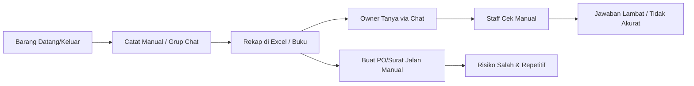
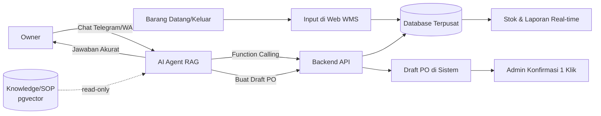

# Business Requirements Document (BRD)

**Project:** Otomatisasi Warehouse Management System (WMS) dan Tata Kelola Dokumen Berbasis Web dengan Integrasi Asisten AI (RAG) pada Platform Pesan Instan

**Document Type:** Business Requirements Document
**Version:** 1.0.0
**Status:** Draft
**Author:** Project Owner
**Date:** 2026-09-22

---

## 1. Document Control

### 1.1 Revision History

| Version | Date       | Author        | Description                        |
| :------ | :--------- | :------------ | :--------------------------------- |
| 1.0.0   | 2026-09-22 | Project Owner | Initial BRD derived from project requirements |

### 1.2 Related Documents

| Ref | Document                                         | Location   |
| :-- | :----------------------------------------------- | :--------- |
| D1  | Functional Specification Document (FSD)          | `docs/FSD.md` |
| D2  | Entity Relationship Diagram (ERD) & Prisma Schema| `docs/ERD.md` |
| D3  | Technical Design Document (Build Guide)          | `docs/TECHNICAL.md` |

### 1.3 Glossary

| Term        | Definition                                                                                   |
| :---------- | :------------------------------------------------------------------------------------------- |
| **WMS**     | Warehouse Management System — sistem tata kelola gudang (barang masuk, keluar, stok).        |
| **PO**      | Purchase Order — dokumen pesanan pembelian/pengiriman.                                        |
| **Surat Jalan** | Delivery Note — dokumen yang menyertai pengiriman barang ke customer.                     |
| **RAG**     | Retrieval-Augmented Generation — arsitektur AI yang membatasi jawaban pada data perusahaan.   |
| **FMCG**    | Fast-Moving Consumer Goods — barang dengan perputaran cepat (contoh: frozen food).            |
| **SKU**     | Stock Keeping Unit — kode unik identitas barang.                                              |
| **Owner**   | Pemilik usaha / pengambil keputusan strategis.                                                |
| **Admin**   | Staf operasional gudang yang menggunakan dashboard web.                                       |
| **Stock Opname** | Proses penghitungan fisik stok untuk rekonsiliasi dengan catatan sistem.                |

---

## 2. Executive Summary

UMKM di sektor *fast-moving* seperti frozen food menghadapi tekanan operasional yang tinggi: barang masuk dan keluar setiap hari dalam jumlah besar, sementara pencatatan sering masih manual atau tersebar di grup chat. Akibatnya muncul selisih stok, keterlambatan pengambilan keputusan, dan beban administratif berulang.

Proyek ini membangun **sistem WMS berbasis web** untuk staf admin, yang dilengkapi **asisten AI berbasis RAG (Retrieval-Augmented Generation)** yang diakses melalui **platform pesan instan (Telegram/WhatsApp)** untuk owner/manager. Sistem memisahkan *user experience* berdasarkan peran: admin bekerja di dashboard web yang komprehensif, sedangkan owner cukup "chatting" dengan AI untuk mengecek stok, merekap pengiriman, atau membuat draft PO.

Keunikan (novelty) proyek terletak pada **AI yang terikat pada database perusahaan** — bukan pengetahuan internet — sehingga jawaban akurat, bebas halusinasi, dan dapat langsung mengeksekusi *workflow* bisnis (*intent-to-action*).

---

## 3. Background & Problem Statement

### 3.1 Business Context

Pemilik usaha distribusi frozen food memiliki mobilitas tinggi dan mengelola perputaran barang yang sangat cepat. Saat ini pencatatan barang masuk/keluar dan pembuatan dokumen (PO/Surat Jalan) dilakukan secara manual atau melalui grup chat, lalu direkap kemudian.

### 3.2 Problem Statement

| ID     | Problem                          | Description                                                                                                                   | Business Impact                                                   |
| :----- | :------------------------------- | :---------------------------------------------------------------------------------------------------------------------------- | :---------------------------------------------------------------- |
| P-001  | **Friction of Access**           | Owner harus membuka laptop, login ke dashboard web, dan memfilter tabel hanya untuk mengecek sisa stok atau status pengiriman. | Keputusan tertunda, data *real-time* tidak dimanfaatkan.          |
| P-002  | **Human Error pada Volume Tinggi** | Perputaran barang cepat; pencatatan manual/grup chat rentan salah dan sulit direkonsiliasi.                                  | Selisih stok (*stock opname*), kehilangan barang, kerugian.       |
| P-003  | **Keterlambatan Keputusan**      | Tanpa akses data instan, owner ragu menerima pesanan besar karena tidak yakin sisa persediaan.                                | Kehilangan momentum penjualan & peluang bisnis.                   |
| P-004  | **Beban Administratif Repetitif**| Pembuatan dokumen harian (PO, Surat Jalan) menyita waktu produktif staf operasional.                                          | Produktivitas turun, biaya tenaga kerja tidak efektif.            |
| P-005  | **Adopsi Teknologi Rendah**      | Sistem ERP/WMS canggih sering ditinggalkan karena terasa "terlalu ribet" bagi owner UMKM.                                     | Investasi teknologi tidak menghasilkan ROI.                       |

### 3.3 Root Cause

Kesenjangan antara **kompleksitas sistem** dan **kebiasaan komunikasi alami** pengguna. Solusinya adalah menyediakan antarmuka yang sudah familiar (chat) dengan *zero-learning-curve*, yang tetap terhubung ke data operasional yang terstruktur.

---

## 4. Business Objectives & Goals

| ID    | Objective                                                                                             | Aligned Problems |
| :---- | :---------------------------------------------------------------------------------------------------- | :--------------- |
| OBJ-1 | Menyediakan akses data inventori *real-time* kepada owner tanpa harus membuka dashboard web.          | P-001, P-003      |
| OBJ-2 | Mengurangi selisih stok melalui pencatatan transaksi masuk/keluar yang terpusat dan tervalidasi.      | P-002             |
| OBJ-3 | Mempercepat pembuatan dokumen (PO & Surat Jalan) melalui otomatisasi dan eksekusi via chat.           | P-004             |
| OBJ-4 | Meningkatkan adopsi teknologi dengan antarmuka chat yang *zero-learning-curve*.                       | P-005             |
| OBJ-5 | Menyediakan laporan operasional harian yang dapat diandalkan untuk pengambilan keputusan.             | P-001, P-003      |

---

## 5. Scope

### 5.1 In-Scope

1. **WMS Web Application** untuk admin gudang:
   - Manajemen master data: Product, Category, Partner (Supplier/Customer), Warehouse.
   - Transaksi **Inbound** (barang masuk) dan **Outbound** (barang keluar).
   - Manajemen **Purchase Order** (draft → confirmed → completed → cancelled).
   - Manajemen **Surat Jalan / Delivery Note**.
   - Dashboard stok dan laporan operasional.
   - Autentikasi & manajemen pengguna berbasis peran.
2. **AI Chat Assistant** via Telegram (MVP) / WhatsApp (tahap lanjut):
   - Intent: cek stok, rekap pengiriman harian, buat draft PO, tanya SOP/knowledge.
   - Data bisnis diakses via *function/tool calling* ke backend API (bukan Text-to-SQL langsung).
   - Knowledge/SOP dijawab via **RAG retrieval** *read-only* dari vector store (`document_chunks`).
   - Guardrail anti-halusinasi & audit percakapan.
3. **Backend REST API** terpusat sebagai sumber logika bisnis.
4. **Deployment** berbasis container (Docker Compose).

### 5.2 Out-of-Scope

| Item                                     | Reason                                             |
| :--------------------------------------- | :------------------------------------------------- |
| Modul akuntansi / jurnal keuangan        | Skala capstone; fokus pada operasional gudang.      |
| Payroll & HR                             | Di luar domain inventori.                           |
| Multi-tenant SaaS / multi-perusahaan     | Diasumsikan satu perusahaan (single tenant).        |
| Aplikasi mobile native (Android/iOS)     | Antarmuka mobile diwakili oleh chat.                |
| Integrasi EDI / marketplace / e-invoice  | Kompleksitas integrasi eksternal di luar cakupan.   |
| Demand forecasting / ML prediktif        | Fitur lanjutan pasca-MVP.                            |

---

## 6. Stakeholders & User Roles

| Role                    | Type          | Responsibilities                                                        | Primary Interface |
| :---------------------- | :------------ | :---------------------------------------------------------------------- | :---------------- |
| **Owner / Manager**     | Business User | Mengambil keputusan, memantau stok & pengiriman, menyetujui PO.         | Chat (Telegram/WhatsApp) |
| **Warehouse Admin**     | Operational   | Input transaksi, kelola master data, proses PO & Surat Jalan.           | Web Dashboard     |
| **Super Admin**         | Technical     | Mengelola user, role, konfigurasi sistem, audit log.                    | Web Dashboard     |
| **Supplier / Customer** | External      | Menerima/mengirim barang; berinteraksi via dokumen (PO/Surat Jalan).    | Dokumen cetak/PDF |

---

## 7. Process Overview

### 7.1 As-Is (Current State)

### 7.2 To-Be (Future State)

---

## 8. Business Requirements

> Setiap requirement dapat dilacak ke Functional Requirements (FR) pada [FSD](./FSD.md).

| ID     | Business Requirement                                                          | Priority | Traces To      |
| :----- | :---------------------------------------------------------------------------- | :------- | :------------- |
| BR-001 | Sistem harus menyimpan data master barang, kategori, partner, dan gudang.      | Must     | FR-03          |
| BR-002 | Sistem harus mencatat setiap barang masuk dan keluar secara terpusat.          | Must     | FR-04, FR-05   |
| BR-003 | Stok barang harus dihitung otomatis dari transaksi (tidak diedit manual).      | Must     | FR-04, FR-05   |
| BR-004 | Sistem harus mendukung pembuatan dan pengelolaan Purchase Order.               | Must     | FR-06          |
| BR-005 | Sistem harus mendukung pembuatan Surat Jalan / Delivery Note.                   | Should   | FR-07          |
| BR-006 | Owner harus dapat menanyakan stok & pengiriman melalui chat.                   | Must     | FR-08          |
| BR-007 | AI harus menjawab hanya berdasarkan data perusahaan (anti-halusinasi).         | Must     | FR-08          |
| BR-008 | AI harus dapat membuat draft PO dari instruksi bahasa natural.                 | Must     | FR-06, FR-08   |
| BR-009 | Sistem harus menyediakan dashboard & laporan operasional harian.               | Should   | FR-09          |
| BR-010 | Sistem harus membatasi akses berdasarkan peran pengguna.                       | Must     | FR-02          |
| BR-011 | Setiap perubahan data penting harus tercatat pada audit log.                    | Should   | FR-10          |
| BR-012 | Sistem harus berjalan pada arsitektur container yang dapat di-deploy ulang.    | Should   | NFR-10         |
| BR-013 | Owner dapat menanyakan SOP/kebijakan internal melalui chat, dijawab dari knowledge base (RAG). | Should | FR-08 |

---

## 9. Business Rules

| ID          | Rule                                                                                                                    |
| :---------- | :---------------------------------------------------------------------------------------------------------------------- |
| BR-RULE-001 | Stok akhir `Product.stock` adalah hasil kalkulasi dari transaksi IN (+), OUT (−), dan penyesuaian opename; dilarang diubah manual oleh user. |
| BR-RULE-002 | Transaksi OUT tidak boleh melebihi stok tersedia kecuali disetujui (backorder/negatif stok dinonaktifkan pada MVP).   |
| BR-RULE-003 | Setiap PO memiliki nomor unik yang digenerate otomatis (contoh: `PO-202609-001`).                                       |
| BR-RULE-004 | PO yang dibuat via chat AI selalu berstatus `DRAFT` dan wajib dikonfirmasi admin sebelum menjadi `CONFIRMED`.           |
| BR-RULE-005 | Surat Jalan hanya dapat dibuat dari PO berstatus `CONFIRMED` atau `COMPLETED`.                                          |
| BR-RULE-006 | Penghapusan PO hanya diizinkan saat berstatus `DRAFT`; item terkait terhapus otomatis (cascade).                        |
| BR-RULE-007 | AI dilarang mengeksekusi query SQL langsung; semua akses data melalui tools/API yang tervalidasi.                      |
| BR-RULE-008 | Transaksi dan dokumen dapat dicatat untuk lebih dari satu gudang (warehouse).                                            |

---

## 10. Success Metrics / KPIs

| ID    | Metric                                             | Baseline            | Target                    |
| :---- | :------------------------------------------------- | :------------------ | :------------------------ |
| KPI-1 | Waktu owner mendapat info stok/pengiriman           | > 5 menit (manual)  | < 10 detik (chat)         |
| KPI-2 | Selisih stok pada stock opname                      | ≥ 5%                | ≤ 1%                      |
| KPI-3 | Waktu pembuatan draft PO                            | 5–10 menit          | < 1 menit (via chat)      |
| KPI-4 | Akurasi jawaban AI terhadap data aktual             | N/A                 | 100% (dari DB, no halusinasi) |
| KPI-5 | Adopsi chat assistant oleh owner                    | 0%                  | ≥ 70% interaksi harian    |

---

## 11. Assumptions, Constraints & Dependencies

### 11.1 Assumptions
- Satu instalasi melayani satu perusahaan (single tenant).
- Owner memiliki akun Telegram/WhatsApp aktif sebagai kanal utama.
- Data master awal (produk, partner) di-input manual sebelum operasional.
- Koneksi internet tersedia di gudang dan di lokasi owner.

### 11.2 Constraints
- Dikembangkan oleh **solo developer** dalam **5 minggu** (capstone).
- Anggaran berbayar diminimalkan; memakai kanal gratis (Telegram Bot API) untuk MVP.
- Kapasitas server terbatas (VPS) — arsitektur harus ringan.

### 11.3 Dependencies
- Telegram Bot API (Telegraf) / WhatsApp API (Baileys/gateway) untuk kanal chat.
- LLM Provider (OpenAI/Gemini) untuk pengenalan intent & function calling.
- PostgreSQL + ekstensi `pgvector` untuk penyimpanan relasional & vektor.
- Docker & Docker Compose untuk orkestrasi container.

---

## 12. Risks & Mitigation

| ID    | Risk                                              | Probability | Impact | Mitigation                                                              |
| :---- | :------------------------------------------------ | :---------- | :----- | :---------------------------------------------------------------------- |
| R-001 | Scope creep (fitur WMS melebar)                   | High        | High   | Batasi modul ke master data, transaksi, PO, Surat Jalan sesuai scope.    |
| R-002 | AI berhalusinasi (jawaban tidak sesuai data)      | Medium      | High   | Wajib function calling; temperature 0; guardrail system prompt.          |
| R-003 | Koneksi WhatsApp tidak stabil / banned            | Medium      | Medium | MVP pakai Telegram; WhatsApp pakai nomor sekunder/gateway resmi.         |
| R-004 | Waktu pengerjaan melebihi 5 minggu                | High        | High   | Sprint mingguan; prioritaskan *novelty* (AI RAG) di fase awal; kurangi scope non-esensial. |
| R-005 | Data master tidak lengkap/kotor                    | Medium      | Medium | Validasi input, seed data, dan alat impor massal.                        |
| R-006 | Kebocoran kredensial (API key LLM/bot)            | Low         | High   | Simpan di environment/secrets, jangan commit, gunakan `.env`.           |
| R-007 | Kegagalan integrasi chat → backend                | Medium      | High   | Kontrak API yang jelas, integration test (E2E chat ke web).              |

---

## 13. Approval / Sign-off

| Role             | Name          | Signature | Date |
| :--------------- | :------------ | :-------- | :--- |
| Project Sponsor  |               |           |      |
| Business Owner   |               |           |      |
| Project Manager  |               |           |      |
| Technical Lead   |               |           |      |

---

*End of Business Requirements Document*
