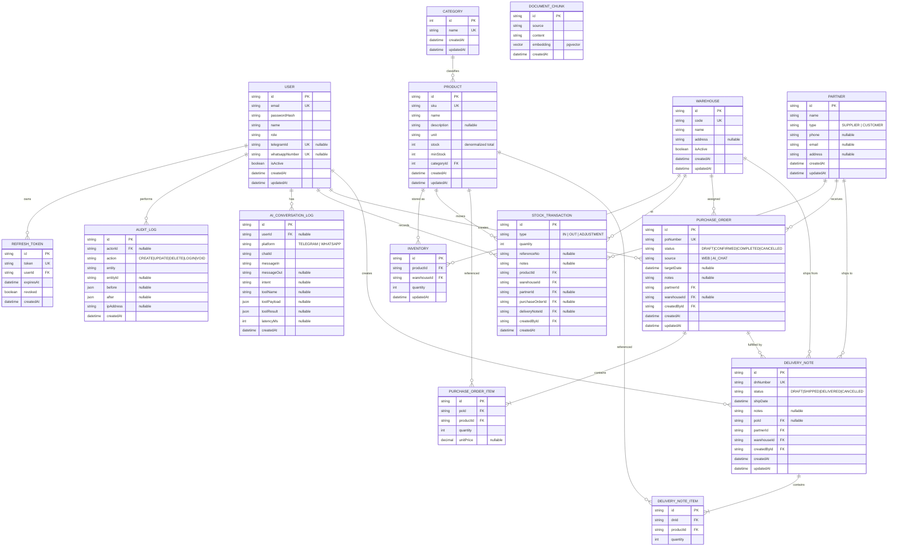

# Entity Relationship Diagram (ERD) & Database Schema

**Project:** Otomatisasi Warehouse Management System (WMS) dan Tata Kelola Dokumen Berbasis Web dengan Integrasi Asisten AI (RAG) pada Platform Pesan Instan

**Document Type:** ERD & Data Model Specification
**Version:** 1.0.0
**Status:** Draft
**Author:** Project Owner
**Date:** 2026-09-22

**Related Documents:** [BRD](./BRD.md) · [FSD](./FSD.md) · [TECHNICAL](./TECHNICAL.md)

---

## 1. Overview

Dokumen ini mendefinisikan model data sistem WMS + AI RAG. Skema mencakup **skema inti awal** (Category, Product, Partner, StockTransaction, PurchaseOrder) dan **perluasan secukupnya** untuk kebutuhan produksi: autentikasi (User, RefreshToken), multi-gudang (Warehouse, Inventory), Surat Jalan (DeliveryNote), audit (AuditLog), riwayat percakapan AI (AiConversationLog), dan knowledge base RAG (DocumentChunk).

### 1.1 Notation

| Symbol       | Meaning                                        |
| :----------- | :--------------------------------------------- |
| `PK`         | Primary Key                                    |
| `FK`         | Foreign Key                                    |
| `UK`         | Unique Key                                     |
| `||--o{`     | One-to-Many (one side mandatory, many optional)|
| `||--|{`     | One-to-Many (both mandatory)                   |
| `||--o|`     | One-to-Zero-or-One                             |
| `}o--o{`     | Many-to-Many (via join entity in practice)     |

> ERD dirender dengan **Mermaid `erDiagram`** agar kompatibel dengan GitHub dan Obsidian.

---

## 2. ERD Diagram



---

## 3. Entity Catalog

### 3.1 `User`

Menyimpan akun pengguna dashboard & pemetaan kanal chat.

| Column          | Type          | Constraint            | Description                                   |
| :-------------- | :------------ | :-------------------- | :-------------------------------------------- |
| `id`            | UUID (String) | PK                    | Identitas user.                               |
| `email`         | String        | UK, not null          | Email login.                                  |
| `passwordHash`  | String        | not null              | Hash password (bcrypt/argon2).                |
| `name`          | String        | not null              | Nama lengkap.                                 |
| `role`          | Enum `UserRole` | not null, default `ADMIN` | `SUPER_ADMIN`, `ADMIN`, `OWNER`.        |
| `telegramId`    | String        | UK, nullable          | Mapping ke chat Telegram.                     |
| `whatsappNumber`| String        | UK, nullable          | Mapping ke WhatsApp (tahap lanjut).           |
| `isActive`      | Boolean       | not null, default true| Menonaktifkan user tanpa hapus.               |
| `createdAt`     | DateTime      | default now()         | Timestamp dibuat.                             |
| `updatedAt`     | DateTime      | @updatedAt            | Timestamp diubah.                             |

### 3.2 `RefreshToken`

| Column      | Type          | Constraint        | Description                       |
| :---------- | :------------ | :---------------- | :-------------------------------- |
| `id`        | UUID (String) | PK                | Identitas token.                  |
| `token`     | String        | UK, not null      | Token refresh.                    |
| `userId`    | String        | FK → User.id      | Pemilik token.                    |
| `expiresAt` | DateTime      | not null          | Waktu kadaluarsa.                 |
| `revoked`   | Boolean       | default false     | Status pencabutan (logout).       |
| `createdAt` | DateTime      | default now()     | Timestamp dibuat.                 |

### 3.3 `Warehouse`

| Column      | Type          | Constraint        | Description                     |
| :---------- | :------------ | :---------------- | :------------------------------ |
| `id`        | UUID (String) | PK                | Identitas gudang.               |
| `code`      | String        | UK, not null      | Kode gudang (mis. `GDG-01`).    |
| `name`      | String        | not null          | Nama gudang.                    |
| `address`   | String?       | nullable          | Alamat gudang.                  |
| `isActive`  | Boolean       | default true      | Status aktif.                   |
| `createdAt` | DateTime      | default now()     | Timestamp dibuat.               |
| `updatedAt` | DateTime      | @updatedAt        | Timestamp diubah.               |

### 3.4 `Category`

| Column      | Type       | Constraint   | Description              |
| :---------- | :--------- | :----------- | :----------------------- |
| `id`        | Int        | PK, autoincrement | Identitas kategori. |
| `name`      | String     | UK, not null | Nama kategori.           |
| `createdAt` | DateTime   | default now()| Timestamp dibuat.        |
| `updatedAt` | DateTime   | @updatedAt   | Timestamp diubah.        |

### 3.5 `Product`

| Column        | Type          | Constraint          | Description                                |
| :------------ | :------------ | :------------------ | :----------------------------------------- |
| `id`          | UUID (String) | PK                  | Identitas produk.                          |
| `sku`         | String        | UK, not null        | Kode barang (mis. `DMS-SDG-01`).           |
| `name`        | String        | not null            | Nama barang.                               |
| `description` | String?       | nullable            | Deskripsi barang.                          |
| `unit`        | String        | not null            | Satuan (pack, kg, box).                    |
| `stock`       | Int           | default 0           | **Total stok terdenormalisasi** (cache dari `Inventory`). |
| `minStock`    | Int           | default 0           | Ambang batas low-stock alert.              |
| `categoryId`  | Int           | FK → Category.id    | Kategori produk.                           |
| `createdAt`   | DateTime      | default now()       | Timestamp dibuat.                          |
| `updatedAt`   | DateTime      | @updatedAt          | Timestamp diubah.                          |

> **Catatan:** `stock` bersifat *denormalized aggregate* dari `Inventory` (per gudang) demi performa query AI (FR-08/`cek_stok_barang`). Perubahan hanya melalui transaksi, bukan update manual (BR-RULE-001).

### 3.6 `Inventory` (join: Product × Warehouse)

| Column        | Type          | Constraint                        | Description                    |
| :------------ | :------------ | :-------------------------------- | :----------------------------- |
| `id`          | UUID (String) | PK                                | Identitas baris inventory.     |
| `productId`   | String        | FK → Product.id                   | Produk.                        |
| `warehouseId` | String        | FK → Warehouse.id                 | Gudang.                        |
| `quantity`    | Int           | default 0                         | Stok di gudang ini.            |
| `updatedAt`   | DateTime      | @updatedAt                        | Timestamp diubah.              |
| —             | —             | **UK (productId, warehouseId)**   | Kombinasi unik.                |

### 3.7 `Partner`

| Column      | Type       | Constraint           | Description                          |
| :---------- | :--------- | :------------------- | :----------------------------------- |
| `id`        | UUID       | PK                   | Identitas partner.                   |
| `name`      | String     | not null             | Nama PT/Supplier/Customer.           |
| `type`      | Enum `PartnerType` | not null     | `SUPPLIER` / `CUSTOMER`.            |
| `phone`     | String?    | nullable             | Telepon.                             |
| `email`     | String?    | nullable             | Email.                               |
| `address`   | String?    | nullable             | Alamat.                              |
| `createdAt` | DateTime   | default now()        | Timestamp dibuat.                    |
| `updatedAt` | DateTime   | @updatedAt           | Timestamp diubah.                    |

### 3.8 `StockTransaction`

| Column            | Type          | Constraint               | Description                                  |
| :---------------- | :------------ | :----------------------- | :------------------------------------------- |
| `id`              | UUID (String) | PK                       | Identitas transaksi.                         |
| `type`            | Enum `TransactionType` | not null        | `IN`, `OUT`, `ADJUSTMENT`.                   |
| `quantity`        | Int           | not null, > 0            | Jumlah barang.                               |
| `referenceNo`     | String?       | nullable                 | No. referensi (mis. nomor dokumen).          |
| `notes`           | String?       | nullable                 | Alasan/catatan (retur, opname, dll).         |
| `productId`       | String        | FK → Product.id          | Produk yang bergerak.                        |
| `warehouseId`     | String        | FK → Warehouse.id        | Gudang lokasi transaksi.                     |
| `partnerId`       | String?       | FK → Partner.id          | Partner terkait (opsional).                  |
| `purchaseOrderId` | String?       | FK → PurchaseOrder.id    | PO terkait (opsional).                       |
| `deliveryNoteId`  | String?       | FK → DeliveryNote.id     | Surat jalan terkait (opsional).              |
| `createdById`     | String        | FK → User.id             | Pencatat transaksi.                          |
| `createdAt`       | DateTime      | default now()            | Waktu transaksi.                             |

### 3.9 `PurchaseOrder` (Header)

| Column        | Type            | Constraint              | Description                                |
| :------------ | :-------------- | :---------------------- | :----------------------------------------- |
| `id`          | UUID (String)   | PK                      | Identitas PO.                              |
| `poNumber`    | String          | UK, not null            | Nomor unik (mis. `PO-202609-001`).         |
| `status`      | Enum `PoStatus` | default `DRAFT`         | `DRAFT`/`CONFIRMED`/`COMPLETED`/`CANCELLED`.|
| `source`      | Enum `PoSource` | default `WEB`           | `WEB` atau `AI_CHAT`.                      |
| `targetDate`  | DateTime?       | nullable                | Tanggal target pengiriman/penerimaan.      |
| `notes`       | String?         | nullable                | Catatan.                                   |
| `partnerId`   | String          | FK → Partner.id         | Partner tujuan/sumber.                     |
| `warehouseId` | String?         | FK → Warehouse.id       | Gudang terkait.                            |
| `createdById` | String          | FK → User.id            | Pembuat PO (user sistem/AI).               |
| `createdAt`   | DateTime        | default now()           | Timestamp dibuat.                          |
| `updatedAt`   | DateTime        | @updatedAt              | Timestamp diubah.                          |

### 3.10 `PurchaseOrderItem` (Detail)

| Column      | Type          | Constraint                     | Description              |
| :---------- | :------------ | :----------------------------- | :----------------------- |
| `id`        | UUID (String) | PK                             | Identitas baris.         |
| `poId`      | String        | FK → PurchaseOrder.id (Cascade)| Header PO.               |
| `productId` | String        | FK → Product.id                | Produk.                  |
| `quantity`  | Int           | not null, > 0                  | Jumlah.                  |
| `unitPrice` | Decimal?      | nullable                       | Harga satuan (opsional). |

### 3.11 `DeliveryNote` (Surat Jalan — Header)

| Column        | Type            | Constraint              | Description                                |
| :------------ | :-------------- | :---------------------- | :----------------------------------------- |
| `id`          | UUID (String)   | PK                      | Identitas Surat Jalan.                     |
| `dnNumber`    | String          | UK, not null            | Nomor unik (mis. `SJ-202609-001`).         |
| `status`      | Enum `DnStatus` | default `DRAFT`         | `DRAFT`/`SHIPPED`/`DELIVERED`/`CANCELLED`. |
| `shipDate`    | DateTime        | not null                | Tanggal kirim.                             |
| `notes`       | String?         | nullable                | Catatan.                                   |
| `poId`        | String?         | FK → PurchaseOrder.id   | Legacy, tidak dipakai UI baru (DN mandiri).|
| `partnerId`   | String          | FK → Partner.id         | Customer tujuan.                           |
| `warehouseId` | String          | FK → Warehouse.id       | Gudang asal.                               |
| `createdById` | String          | FK → User.id            | Pembuat.                                   |
| `createdAt`   | DateTime        | default now()           | Timestamp dibuat.                          |
| `updatedAt`   | DateTime        | @updatedAt              | Timestamp diubah.                          |

### 3.12 `DeliveryNoteItem` (Detail)

| Column      | Type          | Constraint                       | Description        |
| :---------- | :------------ | :------------------------------- | :----------------- |
| `id`        | UUID (String) | PK                               | Identitas baris.   |
| `dnId`      | String        | FK → DeliveryNote.id (Cascade)   | Header Surat Jalan.|
| `productId` | String        | FK → Product.id                  | Produk.            |
| `quantity`  | Int           | not null, > 0                    | Jumlah.            |

### 3.13 `AuditLog`

| Column      | Type          | Constraint          | Description                          |
| :---------- | :------------ | :------------------ | :----------------------------------- |
| `id`        | UUID (String) | PK                  | Identitas log.                       |
| `actorId`   | String?       | FK → User.id        | Pelaku (nullable untuk sistem).      |
| `action`    | String        | not null            | `CREATE`/`UPDATE`/`DELETE`/`LOGIN`/`VOID`. |
| `entity`    | String        | not null            | Nama entitas.                        |
| `entityId`  | String?       | nullable            | ID entitas terkait.                  |
| `before`    | Json?         | nullable            | Snapshot sebelum perubahan.          |
| `after`     | Json?         | nullable            | Snapshot setelah perubahan.          |
| `ipAddress` | String?       | nullable            | IP pelaku.                           |
| `createdAt` | DateTime      | default now()       | Timestamp.                           |

### 3.14 `AiConversationLog`

| Column       | Type          | Constraint       | Description                          |
| :----------- | :------------ | :--------------- | :----------------------------------- |
| `id`         | UUID (String) | PK               | Identitas log percakapan.            |
| `userId`     | String?       | FK → User.id     | User pengirim (hasil mapping chat).  |
| `platform`   | Enum `ChatPlatform` | not null   | `TELEGRAM` / `WHATSAPP`.             |
| `chatId`     | String        | not null         | ID chat dari platform.               |
| `messageIn`  | String        | not null         | Pesan masuk.                         |
| `messageOut` | String?       | nullable         | Balasan AI.                          |
| `intent`     | String?       | nullable         | Intent terdeteksi.                   |
| `toolName`   | String?       | nullable         | Tool yang dipanggil.                 |
| `toolPayload`| Json?         | nullable         | Parameter tool.                      |
| `toolResult` | Json?         | nullable         | Hasil eksekusi tool.                 |
| `latencyMs`  | Int?          | nullable         | Latensi pemrosesan (ms).             |
| `createdAt`  | DateTime      | default now()    | Timestamp.                           |

### 3.15 `DocumentChunk` (Knowledge Base — pgvector)

Menyimpan potongan dokumen SOP/FAQ beserta embedding untuk **RAG retrieval** oleh AI Agent. Proses *ingest* (chunking + embedding) dijalankan offline; AI Agent mengakses tabel ini **read-only**.

| Column      | Type          | Constraint        | Description                          |
| :---------- | :------------ | :---------------- | :----------------------------------- |
| `id`        | UUID (String) | PK                | Identitas chunk.                     |
| `source`    | String        | not null          | Sumber dokumen (SOP/panduan).        |
| `content`   | String        | not null          | Potongan teks.                       |
| `embedding` | vector(1536)  | not null          | Embedding (pgvector); `text-embedding-3-small`, 1536 dim. |
| `createdAt` | DateTime      | default now()     | Timestamp.                           |

> **Catatan:** dimensi `vector(1536)` harus sama dengan `EMBEDDING_DIMENSIONS` di env AI Agent (lihat [TECHNICAL §5.4 & §9.7](./TECHNICAL.md)). Mengganti model embedding (mis. dimensi berbeda) memerlukan migrasi kolom + re-ingest.

---

## 4. Relationship Matrix

| Parent          | Child                | Cardinality | FK Column (Child)   | On Delete    |
| :-------------- | :------------------- | :---------- | :------------------ | :----------- |
| User            | RefreshToken         | 1 : N       | `userId`            | Cascade      |
| User            | AuditLog             | 1 : N       | `actorId`           | SetNull      |
| User            | AiConversationLog    | 1 : N       | `userId`            | SetNull      |
| User            | StockTransaction     | 1 : N       | `createdById`       | Restrict     |
| User            | PurchaseOrder        | 1 : N       | `createdById`       | Restrict     |
| User            | DeliveryNote         | 1 : N       | `createdById`       | Restrict     |
| Category        | Product              | 1 : N       | `categoryId`        | Restrict     |
| Product         | Inventory            | 1 : N       | `productId`         | Cascade      |
| Warehouse       | Inventory            | 1 : N       | `warehouseId`       | Cascade      |
| Product         | StockTransaction     | 1 : N       | `productId`         | Restrict     |
| Warehouse       | StockTransaction     | 1 : N       | `warehouseId`       | Restrict     |
| Partner         | StockTransaction     | 1 : N       | `partnerId`         | SetNull      |
| Partner         | PurchaseOrder        | 1 : N       | `partnerId`         | Restrict     |
| Warehouse       | PurchaseOrder        | 1 : N       | `warehouseId`       | SetNull      |
| PurchaseOrder   | PurchaseOrderItem    | 1 : N       | `poId`              | Cascade      |
| Product         | PurchaseOrderItem    | 1 : N       | `productId`         | Restrict     |
| PurchaseOrder   | DeliveryNote         | 1 : N       | `poId` (legacy)     | SetNull      |
| Partner         | DeliveryNote         | 1 : N       | `partnerId`         | Restrict     |
| Warehouse       | DeliveryNote         | 1 : N       | `warehouseId`       | Restrict     |
| DeliveryNote    | DeliveryNoteItem     | 1 : N       | `dnId`              | Cascade      |
| Product         | DeliveryNoteItem     | 1 : N       | `productId`         | Restrict     |

---

## 5. Enumerations

| Enum              | Values                                                   |
| :---------------- | :------------------------------------------------------- |
| `UserRole`        | `SUPER_ADMIN`, `ADMIN`, `OWNER`                          |
| `PartnerType`     | `SUPPLIER`, `CUSTOMER`                                   |
| `TransactionType` | `IN`, `OUT`, `ADJUSTMENT`                                |
| `PoStatus`        | `DRAFT`, `CONFIRMED`, `COMPLETED`, `CANCELLED`           |
| `PoSource`        | `WEB`, `AI_CHAT`                                         |
| `DnStatus`        | `DRAFT`, `SHIPPED`, `DELIVERED`, `CANCELLED`             |
| `ChatPlatform`    | `TELEGRAM`, `WHATSAPP`                                   |

---

## 6. Indexes & Constraints

| Entity              | Index / Constraint                                | Purpose                          |
| :------------------ | :------------------------------------------------ | :------------------------------- |
| Product             | `@@index([name])`, `@@index([categoryId])`         | Pencarian & filter (FR-03.3).    |
| Inventory           | `@@unique([productId, warehouseId])`               | Satu baris per produk-gudang.    |
| StockTransaction    | `@@index([productId, createdAt])`, `@@index([type, createdAt])` | Laporan & rekap harian. |
| PurchaseOrder       | `@@index([status])`, `@@index([partnerId])`, `@@index([createdAt])` | Filter list PO.       |
| DeliveryNote        | `@@index([status])`, `@@index([shipDate])`         | Filter & rekap kirim.            |
| AiConversationLog   | `@@index([chatId, createdAt])`, `@@index([intent])`| Audit & evaluasi AI.             |
| AuditLog            | `@@index([entity, entityId])`, `@@index([createdAt])`| Penelusuran perubahan.         |
| DocumentChunk       | `@@index([source])` + ivfflat/HNSW on embedding    | Vector search (pgvector).        |

> **Index vector:** Prisma tidak mendeklarasikan index ivfflat/HNSW untuk kolom `Unsupported("vector(1536)")`. Buat via raw SQL pada migration, contoh:
>
> ```sql
> CREATE INDEX document_chunks_embedding_idx
>   ON document_chunks USING hnsw (embedding vector_cosine_ops);
> ```
>
> **Akses AI Agent:** berikan `GRANT SELECT ON document_chunks TO <ai_agent_role>;` (read-only). Proses ingest memakai role terpisah dengan hak tulis.

---

## 7. Prisma Schema (Expanded, Production-Ready)

```prisma
generator client {
  provider        = "prisma-client-js"
  previewFeatures = ["postgresqlExtensions"]
}

datasource db {
  provider   = "postgresql"
  url        = env("DATABASE_URL")
  extensions = [vector]
}

// ----------------------------------------------------------------------
// 1. AUTH & USERS
// ----------------------------------------------------------------------

model User {
  id             String   @id @default(uuid())
  email          String   @unique
  passwordHash   String
  name           String
  role           UserRole @default(ADMIN)
  telegramId     String?  @unique
  whatsappNumber String?  @unique
  isActive       Boolean  @default(true)

  refreshTokens  RefreshToken[]
  auditLogs      AuditLog[]
  conversations  AiConversationLog[]
  transactions   StockTransaction[]
  purchaseOrders PurchaseOrder[]
  deliveryNotes  DeliveryNote[]

  createdAt      DateTime @default(now())
  updatedAt      DateTime @updatedAt

  @@map("users")
}

enum UserRole {
  SUPER_ADMIN
  ADMIN
  OWNER
}

model RefreshToken {
  id        String   @id @default(uuid())
  token     String   @unique
  userId    String
  user      User     @relation(fields: [userId], references: [id], onDelete: Cascade)
  expiresAt DateTime
  revoked   Boolean  @default(false)
  createdAt DateTime @default(now())

  @@index([userId])
  @@map("refresh_tokens")
}

// ----------------------------------------------------------------------
// 2. MASTER DATA
// ----------------------------------------------------------------------

model Warehouse {
  id        String   @id @default(uuid())
  code      String   @unique
  name      String
  address   String?
  isActive  Boolean  @default(true)

  inventories    Inventory[]
  transactions   StockTransaction[]
  purchaseOrders PurchaseOrder[]
  deliveryNotes  DeliveryNote[]

  createdAt DateTime @default(now())
  updatedAt DateTime @updatedAt

  @@map("warehouses")
}

model Category {
  id        Int       @id @default(autoincrement())
  name      String    @unique
  products  Product[]
  createdAt DateTime  @default(now())
  updatedAt DateTime  @updatedAt

  @@map("categories")
}

model Product {
  id          String  @id @default(uuid())
  sku         String  @unique
  name        String
  description String?
  unit        String
  stock       Int     @default(0) // denormalized aggregate of Inventory
  minStock    Int     @default(0)

  categoryId  Int
  category    Category @relation(fields: [categoryId], references: [id])

  inventories        Inventory[]
  transactions       StockTransaction[]
  poItems            PurchaseOrderItem[]
  deliveryNoteItems  DeliveryNoteItem[]

  createdAt   DateTime @default(now())
  updatedAt   DateTime @updatedAt

  @@index([name])
  @@index([categoryId])
  @@map("products")
}

model Inventory {
  id          String @id @default(uuid())
  productId   String
  warehouseId String
  quantity    Int    @default(0)

  product   Product   @relation(fields: [productId], references: [id], onDelete: Cascade)
  warehouse Warehouse @relation(fields: [warehouseId], references: [id], onDelete: Cascade)

  updatedAt DateTime @updatedAt

  @@unique([productId, warehouseId])
  @@map("inventories")
}

model Partner {
  id      String      @id @default(uuid())
  name    String
  type    PartnerType
  phone   String?
  email   String?
  address String?

  purchaseOrders PurchaseOrder[]
  deliveryNotes  DeliveryNote[]
  transactions   StockTransaction[]

  createdAt DateTime @default(now())
  updatedAt DateTime @updatedAt

  @@index([type])
  @@map("partners")
}

enum PartnerType {
  SUPPLIER
  CUSTOMER
}

// ----------------------------------------------------------------------
// 3. INVENTORY TRANSACTIONS
// ----------------------------------------------------------------------

model StockTransaction {
  id              String          @id @default(uuid())
  type            TransactionType
  quantity        Int
  referenceNo     String?
  notes           String?

  productId       String
  product         Product         @relation(fields: [productId], references: [id])
  warehouseId     String
  warehouse       Warehouse       @relation(fields: [warehouseId], references: [id])

  partnerId       String?
  partner         Partner?        @relation(fields: [partnerId], references: [id], onDelete: SetNull)
  purchaseOrderId String?
  purchaseOrder   PurchaseOrder?  @relation(fields: [purchaseOrderId], references: [id], onDelete: SetNull)
  deliveryNoteId  String?
  deliveryNote    DeliveryNote?   @relation(fields: [deliveryNoteId], references: [id], onDelete: SetNull)

  createdById     String
  createdBy       User            @relation(fields: [createdById], references: [id])

  createdAt       DateTime        @default(now())

  @@index([productId, createdAt])
  @@index([type, createdAt])
  @@index([warehouseId])
  @@map("stock_transactions")
}

enum TransactionType {
  IN
  OUT
  ADJUSTMENT
}

// ----------------------------------------------------------------------
// 4. PURCHASE ORDER
// ----------------------------------------------------------------------

model PurchaseOrder {
  id          String    @id @default(uuid())
  poNumber    String    @unique
  status      PoStatus  @default(DRAFT)
  source      PoSource  @default(WEB)
  targetDate  DateTime?
  notes       String?

  partnerId   String
  partner     Partner   @relation(fields: [partnerId], references: [id])
  warehouseId String?
  warehouse   Warehouse? @relation(fields: [warehouseId], references: [id], onDelete: SetNull)

  createdById String
  createdBy   User      @relation(fields: [createdById], references: [id])

  items         PurchaseOrderItem[]
  deliveryNotes DeliveryNote[]
  transactions  StockTransaction[]

  createdAt   DateTime  @default(now())
  updatedAt   DateTime  @updatedAt

  @@index([status])
  @@index([partnerId])
  @@index([createdAt])
  @@map("purchase_orders")
}

model PurchaseOrderItem {
  id        String  @id @default(uuid())
  quantity  Int
  unitPrice Decimal? @db.Decimal(12, 2)

  poId      String
  po        PurchaseOrder @relation(fields: [poId], references: [id], onDelete: Cascade)
  productId String
  product   Product       @relation(fields: [productId], references: [id])

  @@map("purchase_order_items")
}

enum PoStatus {
  DRAFT
  CONFIRMED
  COMPLETED
  CANCELLED
}

enum PoSource {
  WEB
  AI_CHAT
}

// ----------------------------------------------------------------------
// 5. DELIVERY NOTE (SURAT JALAN)
// ----------------------------------------------------------------------

model DeliveryNote {
  id          String    @id @default(uuid())
  dnNumber    String    @unique
  status      DnStatus  @default(DRAFT)
  shipDate    DateTime
  notes       String?

  poId        String?
  po          PurchaseOrder? @relation(fields: [poId], references: [id], onDelete: SetNull)
  partnerId   String
  partner     Partner       @relation(fields: [partnerId], references: [id])
  warehouseId String
  warehouse   Warehouse     @relation(fields: [warehouseId], references: [id])

  createdById String
  createdBy   User          @relation(fields: [createdById], references: [id])

  items         DeliveryNoteItem[]
  transactions  StockTransaction[]

  createdAt   DateTime      @default(now())
  updatedAt   DateTime      @updatedAt

  @@index([status])
  @@index([shipDate])
  @@map("delivery_notes")
}

model DeliveryNoteItem {
  id        String @id @default(uuid())
  quantity  Int

  dnId      String
  dn        DeliveryNote @relation(fields: [dnId], references: [id], onDelete: Cascade)
  productId String
  product   Product      @relation(fields: [productId], references: [id])

  @@map("delivery_note_items")
}

enum DnStatus {
  DRAFT
  SHIPPED
  DELIVERED
  CANCELLED
}

// ----------------------------------------------------------------------
// 6. AUDIT & AI LOG
// ----------------------------------------------------------------------

model AuditLog {
  id        String   @id @default(uuid())
  actorId   String?
  actor     User?    @relation(fields: [actorId], references: [id], onDelete: SetNull)
  action    String
  entity    String
  entityId  String?
  before    Json?
  after     Json?
  ipAddress String?
  createdAt DateTime @default(now())

  @@index([entity, entityId])
  @@index([createdAt])
  @@map("audit_logs")
}

model AiConversationLog {
  id          String       @id @default(uuid())
  userId      String?
  user        User?        @relation(fields: [userId], references: [id], onDelete: SetNull)
  platform    ChatPlatform
  chatId      String
  messageIn   String
  messageOut  String?
  intent      String?
  toolName    String?
  toolPayload Json?
  toolResult  Json?
  latencyMs   Int?
  createdAt   DateTime     @default(now())

  @@index([chatId, createdAt])
  @@index([intent])
  @@map("ai_conversation_logs")
}

enum ChatPlatform {
  TELEGRAM
  WHATSAPP
}

// ----------------------------------------------------------------------
// 7. RAG VECTOR STORE (KNOWLEDGE/SOP, READ-ONLY DI RUNTIME AI AGENT)
// ----------------------------------------------------------------------

model DocumentChunk {
  id        String                       @id @default(uuid())
  source    String
  content   String
  embedding Unsupported("vector(1536)")
  createdAt DateTime                     @default(now())

  @@index([source])
  @@map("document_chunks")
}
```

---

## 8. How the AI Interacts with the Schema

**Dua jalur akses:**

1. **Data bisnis (write/read)** — AI Agent memanggil Backend REST API (function calling). Backend yang menjalankan query Prisma di bawah ini; AI Agent tidak menyentuh tabel bisnis.
2. **Knowledge/SOP (read-only)** — AI Agent membaca `document_chunks` secara langsung (read-only) via retrieval vector.

| Scenario                | Tool               | Data Access (dijalankan oleh Backend)                                       |
| :---------------------- | :----------------- | :-------------------------------------------------------------------------- |
| Check stock             | `cek_stok_barang`  | `product.findFirst({ where: { name: { contains, mode: insensitive } } })` → return `stock` + `unit`. |
| Product catalog         | `cari_produk`      | `product.findMany({ where: { name/sku contains }, include: { category } })`.  |
| List categories         | `list_kategori`    | `category.findMany({ include: { _count: { products } } })`.                  |
| List partners           | `list_partner`     | `partner.findMany({ where: { type, name/phone contains } })`.                |
| List warehouses         | `list_gudang`      | `warehouse.findMany({ where: { name/code contains } })`.                     |
| Stock per warehouse     | `stok_per_gudang`  | `inventory.findMany({ where: { product.name, warehouse.code/name }, include: { product, warehouse } })`. |
| Inbound/outbound list   | `list_transaksi`   | `stockTransaction.findMany({ where: { type, createdAt range, productId, warehouseId, partnerId }, include: { product, warehouse, partner, purchaseOrder, deliveryNote } })`. |
| Daily shipment recap    | `rekap_pengiriman` | `stockTransaction.findMany({ where: { type: OUT, createdAt: dateRange }, include: { partner, product } })`. |
| PO list (aktif)         | `list_po`          | `purchaseOrder.findMany({ where: { status in (DRAFT, CONFIRMED), partnerId, createdAt range }, include: { partner, warehouse, items.product } })`. |
| PO list (by status)     | `list_po_status`   | `purchaseOrder.findMany({ where: { status in statuses, partnerId, createdAt range }, include: { partner, warehouse, items.product } })`. |
| PO detail               | `detail_po`        | `purchaseOrder.findFirst({ where: { poNumber }, include: {...} })` + agregasi realisasi `stockTransaction` IN. |
| Delivery notes list     | `list_surat_jalan` | `deliveryNote.findMany({ where: { status, partnerId, shipDate range }, include: { po, partner, warehouse, items.product } })`. |
| Low stock               | `stok_tipis`       | `product.findMany()` lalu filter `stock <= minStock`.                        |
| Dashboard summary       | `ringkasan_dashboard` | Agregasi `product.count`, `purchaseOrder.count`, `stockTransaction.count` + transaksi terbaru. |
| Create PO draft         | `buat_draft_po`    | Find `partner` + `product` by name, then `purchaseOrder.create({ status: DRAFT, source: AI_CHAT, items: { create: [...] } })`. |
| Create DN draft         | `buat_draft_surat_jalan` | Find `partner` (wajib CUSTOMER) + `product` + `warehouse` by name, then `deliveryNote.create({ status: DRAFT, items: { create: [...] } })` (stok belum berubah). |

| Scenario (RAG)          | Tool               | Data Access (langsung, read-only)                                            |
| :---------------------- | :----------------- | :--------------------------------------------------------------------------- |
| Tanya SOP/kebijakan     | `cari_sop`         | `SELECT source, content FROM document_chunks ORDER BY embedding <=> :query LIMIT :topK` (role read-only). |

> AI **tidak** menulis SQL langsung untuk data bisnis. Akses data bisnis melalui backend API/tools yang divalidasi (BR-RULE-007, FSD §10). Akses langsung DB hanya untuk retrieval vector, tanpa hak tulis.

---

## 9. Seed Data (Reference)

| Entity    | Sample Row                                                                |
| :-------- | :----------------------------------------------------------------------- |
| User      | `owner@umkm.id` / role `OWNER` / telegramId `123456789`                  |
| User      | `admin@umkm.id` / role `ADMIN`                                           |
| Category  | `Frozen Food`, `Minuman`, `Bumbu`                                        |
| Product   | `DMS-SDG-01` — Dimsum Ayam Ukuran Sedang, unit `pack`, stock `120`       |
| Partner   | `PT Maju Jaya` (CUSTOMER), `CV Sumber Frozen` (SUPPLIER)                 |
| Warehouse | `GDG-01` — Gudang Utama                                                  |

---

*End of Entity Relationship Diagram & Database Schema*
