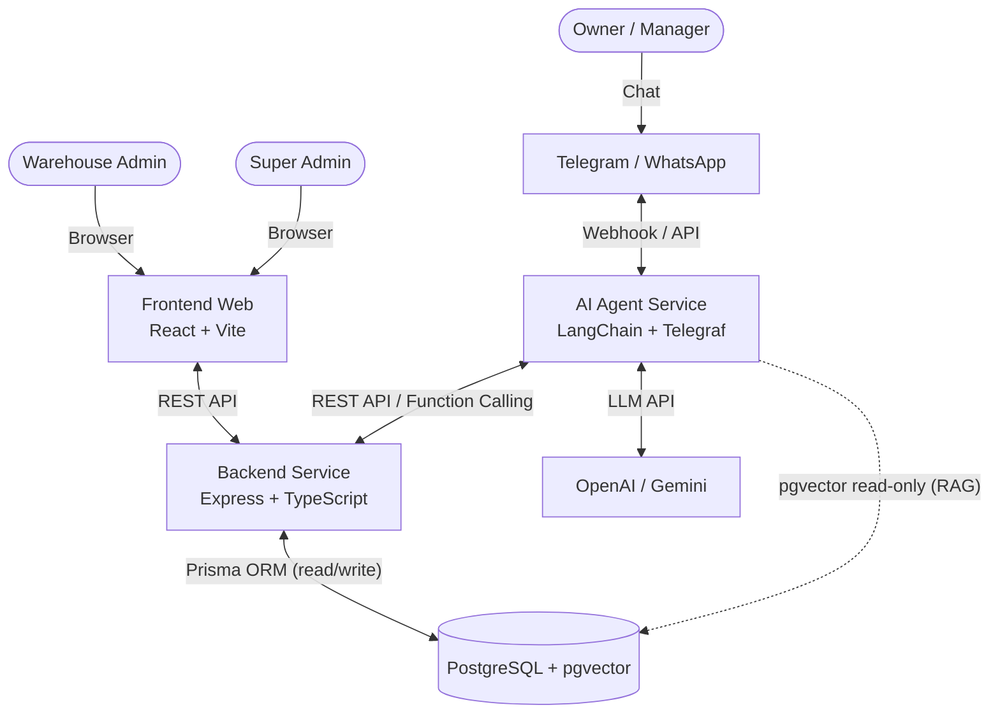
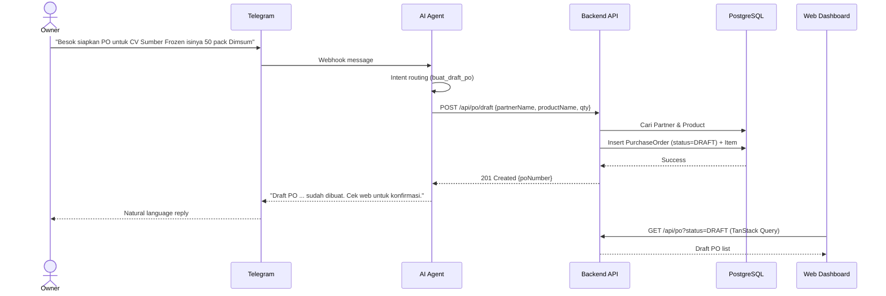
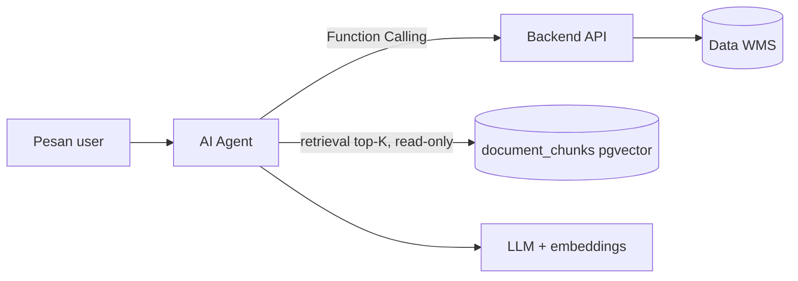
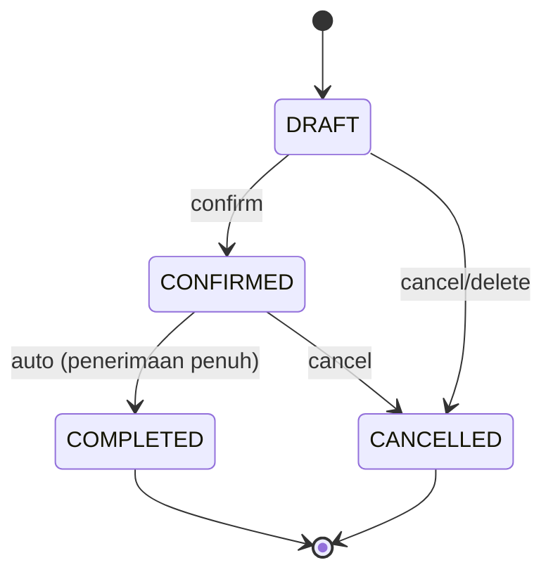

# Functional Specification Document (FSD)

**Project:** Otomatisasi Warehouse Management System (WMS) dan Tata Kelola Dokumen Berbasis Web dengan Integrasi Asisten AI (RAG) pada Platform Pesan Instan

**Document Type:** Functional Specification Document
**Version:** 1.0.0
**Status:** Draft
**Author:** Project Owner
**Date:** 2026-09-22

**Related Documents:** [BRD](./BRD.md) · [ERD](./ERD.md) · [TECHNICAL](./TECHNICAL.md)

---

## 1. Document Control

### 1.1 Revision History

| Version | Date       | Author        | Description                            |
| :------ | :--------- | :------------ | :------------------------------------- |
| 1.0.0   | 2026-09-22 | Project Owner | Initial FSD derived from BRD |

### 1.2 Requirement ID Convention

| Prefix    | Meaning                    |
| :-------- | :------------------------- |
| `FR-xx`   | Functional Requirement     |
| `FR-xx.n` | Sub-functional requirement |
| `NFR-xx`  | Non-Functional Requirement |
| `UC-xx`   | Use Case                   |
| `AC-xx`   | Acceptance Criteria        |

---

## 2. Introduction & Purpose

Dokumen ini menjabarkan spesifikasi fungsional sistem WMS + AI RAG secara rinci, sebagai acuan implementasi oleh developer. Dokumen mencakup arsitektur sistem, kebutuhan fungsional per modul, alur pengguna, spesifikasi API, spesifikasi AI Agent, aturan validasi, kebutuhan non-fungsional, dan skenario pengujian.

Target pembaca: developer, dosen pembimbing/penguji, dan pemangku kepentingan proyek.

---

## 3. System Overview

### 3.1 Context Diagram



> **Catatan arsitektur:** AI Agent hanya diberi akses **read-only** ke tabel vector `document_chunks` (knowledge/SOP). Data bisnis (stok, PO, transaksi) diakses melalui Backend REST API. Backend adalah satu-satunya penulis data bisnis.

### 3.2 Service Responsibilities

| Service      | Responsibility                                                                 |
| :----------- | :----------------------------------------------------------------------------- |
| **Frontend** | UI dashboard WMS: master data, transaksi, PO, Surat Jalan, laporan.            |
| **Backend**  | REST API sentral, logika bisnis, validasi, autentikasi, akses database (read/write). |
| **AI Agent** | Menerima pesan chat, mengenali intent, memanggil tools/API backend, retrieval knowledge (RAG, read-only), menyusun jawaban natural. |
| **Database** | Menyimpan data relasional (WMS) dan vector embeddings untuk knowledge/SOP.      |

### 3.3 End-to-End Workflow (Create PO via Chat)



---

## 4. Tech Stack

| Layer        | Technology                                                       | Function                                                        |
| :----------- | :--------------------------------------------------------------- | :-------------------------------------------------------------- |
| **Frontend** | React (Vite), TypeScript, Tailwind CSS, TanStack Query           | Dashboard WMS, state asinkron, caching, optimistic updates.     |
| **Backend**  | Node.js (Express), TypeScript, Prisma ORM, Zod                   | REST API, logika bisnis, autentikasi, validasi.                 |
| **AI Agent** | Node.js, TypeScript, LangChain.js, Telegraf                      | Webhook chat, RAG retrieval (pgvector, read-only), function calling ke backend. |
| **Database** | PostgreSQL + ekstensi `pgvector`                                 | Data relasional + vector embeddings knowledge/SOP (`document_chunks`).          |
| **Infra**    | Docker, Docker Compose                                           | Isolasi & orkestrasi container.                                 |
| **LLM**      | OpenAI (`gpt-4o-mini`) + `text-embedding-3-small`                | Intent recognition, natural language generation, dan embeddings RAG.           |

---

## 5. Roles & Permission Matrix

| Capability                       | Super Admin | Warehouse Admin | Owner (Chat) |
| :------------------------------- | :---------: | :-------------: | :----------: |
| Manage users & roles             |      ✅     |        ❌       |      ❌      |
| View audit log                   |      ✅     |        ❌       |      ❌      |
| Manage master data (CRUD)        |      ✅     |        ✅       |      ❌      |
| Record inbound/outbound          |      ✅     |        ✅       |      ❌      |
| Create/edit PO                   |      ✅     |        ✅       |  ✅ (draft only) |
| Confirm/cancel PO                |      ✅     |        ✅       |      ❌      |
| Create Surat Jalan               |      ✅     |        ✅       |      ❌      |
| View dashboard & reports         |      ✅     |        ✅       | ✅ (via chat) |
| Chat: check stock                |      ✅     |        ✅       |      ✅      |
| Chat: shipment recap             |      ✅     |        ✅       |      ✅      |
| Chat: create PO draft            |      ✅     |        ✅       |      ✅      |
| Chat: SOP/knowledge (RAG)        |      ✅     |        ✅       |      ✅      |

> **Access control:** JWT-based authentication (access + refresh token). AI chat authenticated by mapping `chatUserId` → `User.telegramId`/`whatsappNumber`.

---

## 6. Functional Requirements

### FR-01 — Authentication & Session

| ID       | Requirement                                                                                  | Priority |
| :------- | :------------------------------------------------------------------------------------------- | :------- |
| FR-01.1  | User dapat login dengan email & password.                                                    | Must     |
| FR-01.2  | Password disimpan sebagai hash (bcrypt/argon2).                                               | Must     |
| FR-01.3  | Sistem menerbitkan JWT access token (short-lived) & refresh token (long-lived).               | Must     |
| FR-01.4  | User dapat logout (invalidate refresh token).                                                 | Must     |
| FR-01.5  | Sistem membatasi endpoint berdasarkan role (RBAC middleware).                                 | Must     |
| FR-01.6  | Sesi chat (Telegram) dipetakan ke user terdaftar; pesan dari nomor tak dikenal ditolak/di-ignore. | Must |

### FR-02 — User & Role Management

| ID       | Requirement                                                          | Priority |
| :------- | :------------------------------------------------------------------- | :------- |
| FR-02.1  | Super Admin dapat membuat, mengubah, menonaktifkan user.             | Must     |
| FR-02.2  | Super Admin dapat menetapkan role (`SUPER_ADMIN`, `ADMIN`, `OWNER`). | Must     |
| FR-02.3  | User dapat mengaitkan akun dengan `telegramId` / `whatsappNumber`.   | Must     |
| FR-02.4  | Sistem menolak akses dari user non-aktif.                            | Must     |

### FR-03 — Master Data

| ID       | Requirement                                                                                   | Priority |
| :------- | :-------------------------------------------------------------------------------------------- | :------- |
| FR-03.1  | CRUD **Category** (nama unik).                                                                 | Must     |
| FR-03.2  | CRUD **Product** (SKU unik, nama, deskripsi, unit, category, stock, min stock).                | Must     |
| FR-03.3  | Pencarian & filter produk berdasarkan nama/SKU/kategori.                                      | Must     |
| FR-03.4  | CRUD **Partner** dengan tipe `SUPPLIER` / `CUSTOMER` (nama, phone, address).                   | Must     |
| FR-03.5  | CRUD **Warehouse** (kode, nama, alamat).                                                       | Must     |
| FR-03.6  | Sistem mencegah penghapusan master data yang masih direferensikan transaksi (restrict).        | Must     |
| FR-03.7  | Sistem memberi peringatan jika stok produk di bawah `minStock` (low-stock alert).              | Should   |

### FR-04 — Inbound (Barang Masuk)

| ID       | Requirement                                                                                   | Priority |
| :------- | :-------------------------------------------------------------------------------------------- | :------- |
| FR-04.1  | Admin dapat mencatat transaksi barang masuk (produk, qty, warehouse, catatan, tanggal).        | Must     |
| FR-04.2  | Setiap transaksi masuk menambah `Product.stock` secara otomatis.                               | Must     |
| FR-04.3  | Transaksi masuk dapat dikaitkan ke sebuah PO supplier berstatus `CONFIRMED` (opsional).        | Should   |
| FR-04.4  | Sistem menolak qty ≤ 0.                                                                        | Must     |
| FR-04.5  | Sistem mencatat `createdById` & timestamp.                                                     | Must     |
| FR-04.6  | Admin dapat membatalkan (void) transaksi dengan alasan, dan stok dikoreksi (soft reversal).    | Should   |
| FR-04.7  | Sistem menolak penerimaan yang melebihi sisa pesanan PO (over-receipt).                        | Must     |
| FR-04.8  | PO otomatis menjadi `COMPLETED` saat seluruh item terpenuhi; kembali `CONFIRMED` bila void.     | Should   |

### FR-05 — Outbound (Barang Keluar)

| ID       | Requirement                                                                                   | Priority |
| :------- | :-------------------------------------------------------------------------------------------- | :------- |
| FR-05.1  | Admin dapat mencatat transaksi barang keluar (produk, qty, warehouse, catatan, tanggal).       | Must     |
| FR-05.2  | Setiap transaksi keluar mengurangi `Product.stock` secara otomatis.                            | Must     |
| FR-05.3  | Sistem menolak transaksi keluar jika qty > stok tersedia (BR-RULE-002).                        | Must     |
| FR-05.4  | Transaksi keluar dapat dikaitkan dengan Surat Jalan / customer (opsional).                     | Should   |
| FR-05.5  | Sistem mencatat `createdById` & timestamp.                                                     | Must     |

### FR-06 — Purchase Order

| ID       | Requirement                                                                                   | Priority |
| :------- | :-------------------------------------------------------------------------------------------- | :------- |
| FR-06.1  | Admin dapat membuat PO (partner, target date, catatan, item list).                             | Must     |
| FR-06.2  | Sistem men-generate `poNumber` unik otomatis.                                                  | Must     |
| FR-06.3  | PO baru berstatus `DRAFT`.                                                                      | Must     |
| FR-06.4  | Admin dapat mengubah PO saat `DRAFT` (termasuk item).                                           | Must     |
| FR-06.5  | Admin dapat mengonfirmasi PO → `CONFIRMED`.                                                     | Must     |
| FR-06.6  | PO otomatis menjadi `COMPLETED` saat seluruh item diterima via Barang Masuk (tanpa aksi selesai manual). | Must     |
| FR-06.7  | Admin dapat membatalkan PO → `CANCELLED`.                                                       | Must     |
| FR-06.8  | Sistem hanya mengizinkan penghapusan PO saat `DRAFT` (cascade item).                            | Must     |
| FR-06.9  | AI dapat membuat PO `DRAFT` dari instruksi bahasa natural (lihat FR-08).                        | Must     |
| FR-06.10 | Sistem menampilkan daftar PO dengan filter status/partner/tanggal.                              | Should   |
| FR-06.11 | Sistem dapat mengekspor PO ke PDF.                                                              | Could    |

### FR-07 — Delivery Note (Surat Jalan)

| ID       | Requirement                                                                                   | Priority |
| :------- | :-------------------------------------------------------------------------------------------- | :------- |
| FR-07.1  | Admin dapat membuat Surat Jalan untuk partner bertipe `CUSTOMER` secara mandiri (tanpa PO).      | Must     |
| FR-07.2  | Sistem men-generate nomor Surat Jalan unik.                                                     | Should   |
| FR-07.3  | Surat Jalan berisi partner, daftar item, qty, dan tanggal kirim.                                | Should   |
| FR-07.4  | Konfirmasi Surat Jalan membuat transaksi OUT otomatis (opsional, sesuai konfigurasi).            | Could    |
| FR-07.5  | Surat Jalan dapat dicetak (browser print / simpan sebagai PDF).                                   | Could    |
| FR-07.6  | Status Surat Jalan: `DRAFT`, `SHIPPED`, `DELIVERED`, `CANCELLED`.                               | Should   |
| FR-07.7  | Admin dapat melihat halaman detail Surat Jalan (header, item, transaksi OUT terkait).            | Should   |
| FR-07.8  | Admin dapat mengubah detail Surat Jalan (partner, gudang, tanggal, catatan, item) selama status `DRAFT`. | Should |

### FR-08 — AI Chat Assistant

| ID       | Requirement                                                                                   | Priority |
| :------- | :-------------------------------------------------------------------------------------------- | :------- |
| FR-08.1  | Sistem menerima pesan masuk dari Telegram (MVP) / WhatsApp (lanjutan).                          | Must     |
| FR-08.2  | AI mengenali intent baca: **check stock**, **product catalog**, **daily shipment recap**, **inbound/outbound transactions**, **PO list/detail**, **delivery notes**, **partners**, **warehouses**, **low stock**, **dashboard**, dan intent tulis: **create PO draft**, serta **SOP/knowledge (RAG)**. | Must |
| FR-08.3  | AI memanggil tools (function calling) untuk membaca/menulis data bisnis — dilarang raw SQL.     | Must     |
| FR-08.4  | Jawaban AI hanya berdasarkan data dari backend (anti-halusinasi, temperature 0).                | Must     |
| FR-08.5  | AI membalas dengan bahasa Indonesia natural & profesional.                                      | Must     |
| FR-08.6  | Jika data tidak ditemukan, AI memberi pesan jelas (bukan mengarang).                            | Must     |
| FR-08.7  | Semua percakapan dicatat pada `AiConversationLog` (audit & evaluasi).                           | Should   |
| FR-08.8  | AI hanya melayani user yang terautentikasi (mapping chat ID → user).                            | Must     |
| FR-08.9  | AI memberikan feedback "typing" saat memproses.                                                 | Should   |
| FR-08.10 | Sistem menangani error LLM/downstream dengan pesan ramah ke user.                               | Must     |
| FR-08.11 | AI menjawab pertanyaan SOP/kebijakan dari knowledge base via retrieval vector (RAG), read-only ke `document_chunks`. | Should |
| FR-08.12 | Jawaban SOP hanya bersumber dari konteks retrieval (grounded), menyebutkan sumber bila tersedia. | Must   |
| FR-08.13 | Knowledge base dapat di-*ingest* dari dokumen SOP (chunking + embeddings) via proses terpisah.   | Should   |
| FR-08.14 | AI dapat membaca seluruh data operasional (produk, kategori, partner, gudang, transaksi masuk/keluar, PO, surat jalan, laporan) via tool read-only ke Backend API. | Should |
| FR-08.15 | AI membedakan barang masuk (IN) dan barang keluar (OUT), serta menyampaikan hasil kosong apa adanya (tidak mengarang, tidak menyerah selama masih ada tool relevan). | Must |
| FR-08.16 | AI dapat membuat draft Surat Jalan (Delivery Note) dari instruksi bahasa natural untuk partner CUSTOMER; status selalu DRAFT (stok belum berubah). | Should |

**Intent → Tool Mapping**

| Intent               | Trigger Example                                                    | Tool (`name`)       | Action                          |
| :------------------- | :----------------------------------------------------------------- | :------------------ | :------------------------------ |
| Check stock          | "Ada berapa sisa stok dimsum ukuran sedang?"                        | `cek_stok_barang`   | GET stok by nama produk         |
| Product catalog      | "Produk air mineral ada ukuran apa saja?"                           | `cari_produk`       | GET katalog produk by kata kunci |
| List categories      | "Ada kategori apa saja?"                                            | `list_kategori`     | GET daftar kategori             |
| List partners        | "Siapa saja supplier kita?"                                         | `list_partner`      | GET daftar partner (filter tipe) |
| List warehouses      | "Gudang apa saja yang aktif?"                                       | `list_gudang`       | GET daftar gudang               |
| Stock per warehouse  | "Stok dimsum di gudang mana saja?"                                  | `stok_per_gudang`   | GET inventory per produk/gudang |
| Inbound/outbound     | "Barang masuk tanggal 10 sampai sekarang?"                          | `list_transaksi`    | GET transaksi by type/rentang/filter |
| Daily shipment recap | "Kemarin tgl 20 kita kirim kemana aja?"                            | `rekap_pengiriman`  | GET transaksi OUT by date       |
| PO list aktif        | "Tampilkan PO untuk UD Amanah"                                      | `list_po`           | GET daftar PO aktif (DRAFT & CONFIRMED) by partner/tanggal |
| PO list by status    | "Tampilkan PO yang confirmed"                                       | `list_po_status`    | GET daftar PO by status/partner/tanggal |
| PO detail            | "Detail PO-202609-001"                                              | `detail_po`         | GET detail PO + realisasi      |
| Delivery notes       | "Surat jalan yang belum terkirim?"                                  | `list_surat_jalan`  | GET daftar surat jalan          |
| Low stock            | "Produk apa yang stoknya menipis?"                                  | `stok_tipis`        | GET produk stok <= minStock     |
| Dashboard summary    | "Ringkasan operasional hari ini"                                    | `ringkasan_dashboard` | GET ringkasan dashboard       |
| Create PO draft      | "Besok siapkan PO untuk CV Sumber Frozen isinya 50 pack Dimsum"    | `buat_draft_po`     | POST draft PO (partner supplier)|
| Create DN draft      | "Buat surat jalan untuk Agen Bahari isi 10 pack Dimsum"            | `buat_draft_surat_jalan` | POST draft DN (partner customer) |
| SOP / knowledge       | "Apa SOP penerimaan barang retur?"                                 | `cari_sop`          | Retrieval top-K `document_chunks` (read-only) |

### FR-09 — Dashboard & Reporting

| ID       | Requirement                                                                                   | Priority |
| :------- | :-------------------------------------------------------------------------------------------- | :------- |
| FR-09.1  | Dashboard menampilkan ringkasan: total produk, stok kritis, transaksi hari ini, PO aktif.      | Should   |
| FR-09.2  | Laporan transaksi masuk/keluar per periode dengan filter.                                      | Should   |
| FR-09.3  | Laporan stok terkini per gudang/kategori.                                                       | Should   |
| FR-09.4  | Laporan pengiriman harian (mendukung intent recap AI).                                          | Should   |
| FR-09.5  | Ekspor laporan ke CSV/Excel.                                                                    | Could    |

### FR-10 — Audit Log

| ID       | Requirement                                                                                   | Priority |
| :------- | :-------------------------------------------------------------------------------------------- | :------- |
| FR-10.1  | Sistem mencatat perubahan pada entitas penting (product, PO, transaksi, user).                  | Should   |
| FR-10.2  | Audit log menyimpan: actor, action, entity, entityId, before/after (JSON), timestamp, IP.       | Should   |
| FR-10.3  | Super Admin dapat melihat & memfilter audit log.                                                | Should   |

---

## 7. Use Cases

### UC-01 — Owner Checks Stock via Chat

| Field          | Detail                                                              |
| :------------- | :------------------------------------------------------------------ |
| **Actor**      | Owner                                                               |
| **Precondition** | Owner terdaftar & chat ID ter-mapping ke user aktif.              |
| **Trigger**    | Owner mengirim "Berapa sisa stok dimsum ukuran sedang?"             |
| **Main Flow**  | 1. AI menerima pesan → 2. Intent routing ke `cek_stok_barang` → 3. Query produk via backend → 4. AI menyusun jawaban → 5. Balas ke chat. |
| **Alternate**  | Produk tidak ditemukan → AI minta klarifikasi nama barang.          |
| **Postcondition** | Percakapan tercatat; tidak ada perubahan data.                   |

### UC-02 — Owner Creates PO Draft via Chat

| Field          | Detail                                                              |
| :------------- | :------------------------------------------------------------------ |
| **Actor**      | Owner                                                               |
| **Precondition** | Partner & Product sudah ada di master data.                       |
    | **Trigger**    | "Besok siapkan PO untuk CV Sumber Frozen isinya 50 pack Dimsum"     |
| **Main Flow**  | 1. AI parse intent & parameter → 2. Panggil `buat_draft_po` → 3. Backend validasi & insert PO `DRAFT` → 4. AI konfirmasi ke chat. |
| **Alternate**  | Partner/Product tidak ditemukan → AI informasikan kegagalan.        |
| **Postcondition** | Draft PO muncul di dashboard admin.                               |

### UC-03 — Admin Records Inbound/Outbound

| Field          | Detail                                                              |
| :------------- | :------------------------------------------------------------------ |
| **Actor**      | Warehouse Admin                                                     |
| **Precondition** | Login & produk tersedia.                                         |
| **Trigger**    | Admin membuka form transaksi.                                       |
| **Main Flow**  | 1. (Inbound) pilih PO supplier opsional → produk & gudang → 2. Input qty & catatan → 3. Submit → 4. Sistem update stok (dan sinkron status PO) → 5. TanStack Query invalidate → tabel stok refresh. |
| **Alternate**  | Qty melebihi stok (OUT) → sistem menolak dengan pesan error.        |
| **Postcondition** | Stok ter-update, transaksi tercatat.                              |

### UC-04 — Admin Confirms PO from Chat

| Field          | Detail                                                              |
| :------------- | :------------------------------------------------------------------ |
| **Actor**      | Warehouse Admin                                                     |
| **Precondition** | Terdapat PO `DRAFT` (mungkin dari AI).                            |
| **Trigger**    | Admin membuka halaman PO.                                           |
| **Main Flow**  | 1. Lihat draft PO → 2. Verifikasi item → 3. Klik Confirm → 4. Status `CONFIRMED`. |
| **Postcondition** | PO siap direalisasikan penerimaannya (barang masuk) oleh gudang.  |

---

## 8. Screen Inventory (Frontend)

| ID    | Screen                  | Route                     | Key Elements                                             |
| :---- | :---------------------- | :------------------------ | :------------------------------------------------------- |
| S-01  | Login                   | `/login`                  | Email, password, submit.                                 |
| S-02  | Dashboard               | `/`                       | KPI cards, low-stock alerts, recent transactions.        |
| S-03  | Product List            | `/products`               | Tabel + search/filter, tombol CRUD.                      |
| S-04  | Product Form            | `/products/new`, `/:id/edit` | Form master barang.                                  |
| S-05  | Category List          | `/categories`             | Tabel + CRUD.                                            |
| S-06  | Partner List           | `/partners`               | Tabel + filter tipe (Supplier/Customer) + CRUD.          |
| S-07  | Warehouse List         | `/warehouses`             | Tabel + CRUD.                                            |
| S-08  | Inbound Transactions   | `/inbound`                | Tabel + search/filter + form input.                      |
| S-09  | Outbound Transactions  | `/outbound`               | Tabel + search/filter + form input.                      |
| S-10  | Purchase Order List    | `/purchase-orders`        | Tabel + filter status; highlight draft dari AI.           |
| S-11  | Purchase Order Detail  | `/purchase-orders/:id`    | Header + item (dipesan/diterima/sisa); aksi confirm/cancel/terima barang. |
| S-12  | Delivery Note List     | `/delivery-notes`         | Tabel + CRUD Surat Jalan customer (tanpa PO).            |
| S-12b | Delivery Note Detail   | `/delivery-notes/:id`     | Header + item; aksi kirim/terkirim/batal, edit saat DRAFT, cetak, transaksi OUT terkait. |
| S-13  | Reports                | `/reports`                | Filter periode, tabel, export.                           |
| S-14  | User Management        | `/users`                  | Tabel user + role + mapping chat ID (Super Admin).        |
| S-15  | Audit Log              | `/audit-logs`             | Tabel + filter (Super Admin).                             |

---

## 9. API Specification

### 9.1 Conventions

- **Base URL:** `http://localhost:3000/api`
- **Auth:** `Authorization: Bearer <access_token>`
- **Content-Type:** `application/json`
- **Pagination:** `?page=1&limit=20`
- **Error envelope:** `{ "success": false, "error": { "code": "...", "message": "..." } }`
- **Success envelope:** `{ "success": true, "data": {...}, "meta": {...} }`

### 9.2 Auth & Users

| Method | Endpoint                | Description             | Auth        |
| :----- | :---------------------- | :---------------------- | :---------- |
| POST   | `/auth/login`           | Login, issue tokens     | Public      |
| POST   | `/auth/refresh`         | Refresh access token    | Public      |
| POST   | `/auth/logout`          | Invalidate refresh token| Bearer      |
| GET    | `/users`                | List users              | Super Admin |
| POST   | `/users`                | Create user             | Super Admin |
| PATCH  | `/users/:id`            | Update user/role        | Super Admin |
| DELETE | `/users/:id`            | Deactivate user         | Super Admin |

### 9.3 Master Data

| Method | Endpoint             | Description            | Auth   |
| :----- | :------------------- | :--------------------- | :----- |
| GET    | `/products`          | List products (filter) | Bearer |
| POST   | `/products`          | Create product         | Admin  |
| GET    | `/products/:id`      | Get product detail     | Bearer |
| PATCH  | `/products/:id`      | Update product         | Admin  |
| DELETE | `/products/:id`      | Delete product         | Admin  |
| GET/POST/PATCH/DELETE | `/categories` | Category CRUD | Admin |
| GET/POST/PATCH/DELETE | `/partners`   | Partner CRUD  | Admin |
| GET/POST/PATCH/DELETE | `/warehouses` | Warehouse CRUD| Admin |

### 9.4 Inventory Transactions

| Method | Endpoint               | Description                          | Auth  |
| :----- | :--------------------- | :----------------------------------- | :---- |
| GET    | `/transactions`        | List transactions (filter type/date/product/warehouse/partner/deliveryNoteId/q) | Bearer |
| POST   | `/transactions/inbound`| Record inbound                       | Admin |
| POST   | `/transactions/outbound`| Record outbound                     | Admin |
| POST   | `/transactions/:id/void`| Void transaction (with reason)      | Admin |

### 9.5 Purchase Order

| Method | Endpoint                  | Description                      | Auth        |
| :----- | :------------------------ | :------------------------------- | :---------- |
| GET    | `/po`                     | List PO (filter status/partner)  | Bearer      |
| POST   | `/po`                     | Create PO (status DRAFT)         | Admin       |
| **POST** | **`/po/draft`**         | **Internal: create draft (AI)**  | Service/AI  |
| GET    | `/po/:id`                 | PO detail with items             | Bearer      |
| PATCH  | `/po/:id`                 | Update PO (only DRAFT)           | Admin       |
| POST   | `/po/:id/confirm`         | Confirm PO                       | Admin       |
| POST   | `/po/:id/cancel`          | Cancel PO                        | Admin       |
| DELETE | `/po/:id`                 | Delete PO (only DRAFT)           | Admin       |
| GET    | `/po/:id/pdf`             | Export PO to PDF                 | Bearer      |

**Example — `POST /po/draft` (called by AI Agent):**

```json
// Request
{
  "partnerName": "CV Sumber Frozen",
  "items": [{ "productName": "Dimsum Ayam Sedang", "qty": 50 }],
  "targetDate": "2026-09-23",
  "source": "AI_CHAT"
}

// Response 201
{
  "success": true,
  "data": {
    "id": "9b1d...",
    "poNumber": "PO-202609-001",
    "status": "DRAFT",
    "partner": { "id": "a1...", "name": "CV Sumber Frozen" },
    "items": [{ "productName": "Dimsum Ayam Sedang", "qty": 50 }]
  }
}
```

### 9.6 Delivery Note

| Method | Endpoint              | Description             | Auth  |
| :----- | :-------------------- | :---------------------- | :---- |
| GET    | `/delivery-notes`     | List delivery notes     | Bearer |
| POST   | `/delivery-notes`     | Create for customer     | Admin |
| POST   | `/delivery-notes/draft` | Create draft DN via AI (resolve by nama, status DRAFT) | Internal |
| GET    | `/delivery-notes/:id` | Detail                  | Bearer |
| PUT    | `/delivery-notes/:id` | Update detail (only DRAFT) | Admin |
| PATCH  | `/delivery-notes/:id` | Update status           | Admin |

### 9.7 Reports (internal for AI + web)

Seluruh endpoint di bawah menerima **Bearer (web)** atau **`x-internal-key` (AI Agent)** via `authenticateOrInternal`.

| Method | Endpoint                             | Description                          | Auth        |
| :----- | :----------------------------------- | :----------------------------------- | :---------- |
| GET    | `/reports/stock`                     | Current stock report                 | Bearer/AI   |
| GET    | `/reports/stock/:productName`        | Stock lookup by name (AI tool)       | Bearer/AI   |
| GET    | `/reports/shipments?date=`           | Daily shipment recap (AI tool)       | Bearer/AI   |
| GET    | `/reports/low-stock`                 | Low stock alerts                     | Bearer/AI   |
| GET    | `/reports/dashboard`                 | Operational dashboard summary        | Bearer/AI   |
| GET    | `/reports/products?q=&categoryId=`   | Product catalog (AI tool)            | Bearer/AI   |
| GET    | `/reports/categories?q=`             | Category list (AI tool)              | Bearer/AI   |
| GET    | `/reports/partners?q=&type=`         | Partner list (AI tool)               | Bearer/AI   |
| GET    | `/reports/warehouses?q=`             | Warehouse list (AI tool)             | Bearer/AI   |
| GET    | `/reports/inventory?productName=&warehouseCode=` | Stock per warehouse (AI tool) | Bearer/AI |
| GET    | `/reports/transactions?type=&from=&to=&productName=&warehouseCode=&partnerName=` | Stock transactions (AI tool) | Bearer/AI |
| GET    | `/reports/purchase-orders?status=&partnerName=&from=&to=` | PO list (AI tool) | Bearer/AI |
| GET    | `/reports/purchase-orders/:poNumber` | PO detail + receipt status (AI tool) | Bearer/AI |
| GET    | `/reports/delivery-notes?status=&partnerName=&from=&to=` | Delivery notes list (AI tool) | Bearer/AI |

> Filter berbasis nama (produk/partner/gudang) mencocokkan **semua** substring (mis. `productName=tepung` mengembalikan seluruh produk tepung), bukan hanya yang pertama. Respons menyertakan `matched` (nama entitas yang cocok); bila tidak ada yang cocok, `unmatched` diisi dan `data` kosong (tidak mengembalikan seluruh baris).

> Pencarian produk pada endpoint AI (`/reports/products`, `/reports/inventory`, `/reports/transactions`, `/reports/stock/:productName`) memakai normalisasi + kecocokan token di samping substring, sehingga variasi penulisan seperti `mie instan` cocok dengan `Mi Instan`.
>
> `GET /reports/stock/:productName` mengembalikan objek berstatus, bukan `null`:
> `{ status: "ok", product, candidates: [], suggestions: [] }`,
> `{ status: "ambiguous", product: null, candidates: [{ name, sku, unit, stock, minStock }], suggestions: [] }`, atau
> `{ status: "none", product: null, candidates: [], suggestions: [{ name, sku }] }`.

### 9.8 Error Codes

| HTTP | Code                 | Meaning                              |
| :--- | :------------------- | :----------------------------------- |
| 400  | `VALIDATION_ERROR`   | Invalid input (Zod).                 |
| 401  | `UNAUTHENTICATED`    | Missing/invalid token.               |
| 403  | `FORBIDDEN`          | Insufficient role.                   |
| 404  | `NOT_FOUND`          | Resource not found.                  |
| 409  | `INSUFFICIENT_STOCK` | Outbound exceeds available stock.    |
| 409  | `INVALID_STATE`      | Illegal PO/DN state transition.      |
| 422  | `UNPROCESSABLE`      | Business rule violation.             |
| 500  | `INTERNAL_ERROR`     | Unexpected server error.             |

---

## 10. AI Agent Specification

### 10.1 Architecture

AI Agent memiliki **dua jalur data**:

1. **Data bisnis** — pola **Function/Tool Calling**. AI **tidak** menulis SQL langsung; Backend mengekspos endpoint aman, AI memilih tool dan mengisi parameter tervalidasi (Zod). Backend satu-satunya penulis data bisnis.
2. **Knowledge/SOP** — **RAG retrieval** *read-only* ke tabel `document_chunks` (pgvector). Dokumen SOP di-*ingest* (chunking + embeddings) oleh proses offline terpisah, lalu diambil top-K saat runtime.



### 10.2 Tools

| Tool Name             | Description                              | Parameters (Zod)                                     | Backend/Source                  |
| :-------------------- | :--------------------------------------- | :--------------------------------------------------- | :------------------------------ |
| `cek_stok_barang`     | Cek sisa stok berdasarkan nama barang    | `productName: string`                                | `GET /reports/stock/:productName` |
| `cari_produk`         | Katalog produk (SKU, kategori, stok)     | `q?: string`                                         | `GET /reports/products`         |
| `list_kategori`       | Daftar kategori + jumlah produk          | —                                                    | `GET /reports/categories`       |
| `list_partner`        | Daftar partner (supplier/customer)       | `q?: string`, `type?: "SUPPLIER"\|"CUSTOMER"`         | `GET /reports/partners`         |
| `list_gudang`         | Daftar gudang                            | —                                                    | `GET /reports/warehouses`       |
| `stok_per_gudang`     | Rincian stok per gudang                  | `productName?: string`, `warehouseCode?: string`      | `GET /reports/inventory`        |
| `list_transaksi`      | Transaksi masuk/keluar/penyesuaian       | `direction?: "masuk"\|"keluar"\|"penyesuaian"`, `from?`, `to?`, `productName?`, `warehouseCode?`, `partnerName?` | `GET /reports/transactions` |
| `rekap_pengiriman`    | Rekap barang KELUAR pada satu tanggal    | `date: string` (YYYY-MM-DD)                          | `GET /reports/shipments?date=`  |
| `list_po`             | Daftar PO aktif (DRAFT & CONFIRMED)      | `partnerName?`, `from?`, `to?`                       | `GET /reports/purchase-orders`  |
| `list_po_status`      | Daftar PO dengan status eksplisit        | `statuses: ("DRAFT"\|"CONFIRMED"\|"COMPLETED"\|"CANCELLED")[]`, `partnerName?`, `from?`, `to?` | `GET /reports/purchase-orders`  |
| `detail_po`           | Detail PO + realisasi penerimaan         | `poNumber: string`                                   | `GET /reports/purchase-orders/:poNumber` |
| `list_surat_jalan`    | Daftar Surat Jalan / Delivery Note       | `status?`, `partnerName?`, `from?`, `to?`             | `GET /reports/delivery-notes`   |
| `stok_tipis`          | Produk dengan stok <= minStock           | —                                                    | `GET /reports/low-stock`        |
| `ringkasan_dashboard` | Ringkasan operasional                    | —                                                    | `GET /reports/dashboard`        |
| `buat_draft_po`       | Membuat draft Purchase Order (partner supplier) | `partnerName: string`, `items: {productName, qty}[]` | `POST /po/draft`                |
| `buat_draft_surat_jalan` | Membuat draft Surat Jalan (partner customer) | `partnerName: string`, `items: {productName, qty}[]`, `shipDate?`, `warehouseCode?` | `POST /delivery-notes/draft` |
| `cari_sop`            | Cari SOP/kebijakan/istilah internal (RAG)| `query: string`                                      | `document_chunks` (read-only, top-K) |

> Semua endpoint `/reports/*` menerima **Bearer token (web)** atau **`x-internal-key` (AI Agent)** via middleware `authenticateOrInternal`.

### 10.3 System Prompt Guidelines

```
You are a smart Warehouse Assistant (Virtual WMS) for an Indonesian SME.
- Respond in professional, friendly Bahasa Indonesia.
- NEVER fabricate stock, transaction, shipment, partner, PO, or delivery-note data.
- ALWAYS use provided tools to read or write business data.
- Read capabilities: stock, product catalog, categories, partners, warehouses, stock per warehouse, inbound/outbound transactions, PO list/detail, delivery notes, low stock, dashboard.
- IMPORTANT: rekap_pengiriman is ONLY for OUTBOUND (shipments) on a single date. For inbound, or date ranges, or product/warehouse/partner filters, ALWAYS use list_transaksi. Never label outbound data as inbound.
- If a tool returns not-found or empty, state it plainly; do not invent values and do not give up while a relevant tool remains.
- Cite the date/source when relevant.
- For SOP/policy/term questions, use the cari_sop tool and answer ONLY from returned context; cite the source when available.
- When creating a PO, always keep status DRAFT and remind the user to confirm on the web.
- Purchase Orders are only for SUPPLIER partners; if the requested partner is not a supplier, explain and ask for clarification instead of creating the PO.
- Write capabilities are only: buat_draft_po (SUPPLIER) and buat_draft_surat_jalan (CUSTOMER). Both always create DRAFT.
- Delivery Notes are only for CUSTOMER partners; stock decreases only when the DN is SHIPPED. Ask for items/quantities if not provided.
- Do not reveal internal IDs, SQL, or API keys.
```

### 10.4 Guardrails

| Guardrail             | Implementation                                                      |
| :-------------------- | :------------------------------------------------------------------ |
| No raw SQL (business) | Tools only; backend enforces parameterized Prisma queries.          |
| DB read-only (RAG)    | Runtime AI Agent hanya `SELECT` pada `document_chunks`; tanpa hak tulis. |
| Grounded RAG answer   | Jawab SOP hanya dari konteks hasil retrieval; sebut sumber bila ada. |
| Anti-hallucination    | `temperature = 0`, tool-only data, refuse unknown data.             |
| Authorization         | Map chat ID → registered active user; else reject.                  |
| Rate limiting         | Limit messages per user per minute.                                 |
| Input sanitation      | Zod schemas + validation before any write.                          |
| Audit                 | Log every message + tool call + result to `AiConversationLog`.      |
| Scope limitation      | Read: semua data operasional (stok, transaksi, PO, surat jalan, partner, gudang, laporan). Write: hanya draft PO & draft Surat Jalan. |

### 10.5 Error/Edge Handling

| Scenario                        | AI Behavior                                              |
| :------------------------------ | :------------------------------------------------------- |
| Product not found               | "Saya tidak menemukan barang bernama X. Bisa sebutkan nama lain?" |
| Partner not found               | Inform failure; do not create PO.                        |
| Partner bukan supplier          | Jelaskan PO hanya untuk supplier; minta partner yang benar.|
| Partner bukan customer (DN)     | Jelaskan Surat Jalan hanya untuk customer; minta partner yang benar. |
| DN items belum disebut          | Minta daftar barang & jumlah sebelum membuat draft DN.   |
| Insufficient stock for PO       | Warn user; still create draft (PO does not move stock).  |
| Empty result for data query     | State that no matching data was found; do not invent rows. |
| Ambiguous inbound vs outbound   | Use `list_transaksi` with explicit direction; never relabel outbound as inbound. |
| SOP not found in knowledge base | State that no relevant SOP was found; do not invent policy. |
| LLM/API error                   | "Maaf, sistem sedang mengalami gangguan. Coba lagi nanti."|
| Out-of-scope question           | Politely state limitation and suggest capabilities.      |

---

## 11. Validation & Business Logic Rules

| ID    | Rule                                                                                          |
| :---- | :-------------------------------------------------------------------------------------------- |
| VL-01 | `Product.sku` unik; `Category.name` unik; `poNumber` unik.                                     |
| VL-02 | `quantity` transaksi & PO item harus integer > 0.                                              |
| VL-03 | Outbound: `quantity ≤ Product.stock` (gudang terkait).                                         |
| VL-04 | PO hanya editable saat `DRAFT`; state transition mengikuti diagram pada §11.1.                 |
| VL-05 | Hapus master data yang direferensikan transaksi → ditolak (RESTRICT) kecuali tanpa referensi.  |
| VL-06 | `Product.stock` tidak boleh diubah via endpoint update produk secara langsung.                 |
| VL-07 | Purchase Order hanya untuk partner `SUPPLIER`; Delivery Note hanya untuk partner `CUSTOMER`.    |
| VL-08 | Penerimaan (IN) bertaut PO tidak boleh melebihi sisa pesanan; status PO diamankan otomatis.     |

### 11.1 PO State Machine



---

## 12. Non-Functional Requirements

| ID      | Category        | Requirement                                                                     |
| :------ | :-------------- | :------------------------------------------------------------------------------ |
| NFR-01  | Performance     | Respons API rata-rata < 500 ms untuk operasi CRUD.                              |
| NFR-02  | Performance     | Jawaban AI chat < 5 detik untuk query stok/rekap.                               |
| NFR-03  | Scalability     | Arsitektur container dapat di-scale horizontal per service.                     |
| NFR-04  | Security        | Password hashed; JWT; HTTPS di production; secrets via env.                     |
| NFR-05  | Security        | Validasi input dengan Zod di semua endpoint write.                              |
| NFR-06  | Reliability     | Sistem menangani kegagalan LLM/downstream tanpa crash (graceful degradation).    |
| NFR-07  | Auditability    | Perubahan data penting & percakapan AI tercatat.                                |
| NFR-08  | Usability       | Web dashboard responsif; chat *zero-learning-curve*.                            |
| NFR-09  | Maintainability | Kode TypeScript terstruktur; linting & formatting konsisten.                    |
| NFR-10  | Portability     | Dapat dijalankan via `docker compose up` di Linux/WSL2/VPS.                     |
| NFR-11  | Observability   | Logging terstruktur untuk backend & AI agent.                                   |
| NFR-12  | Security        | AI Agent memakai kredensial DB **read-only** (`SELECT` pada `document_chunks`); least privilege. |

---

## 13. Deployment Topology (Docker Compose)

```yaml
version: '3.8'

services:
  db:
    image: ankane/pgvector:latest
    environment:
      POSTGRES_USER: user
      POSTGRES_PASSWORD: password
      POSTGRES_DB: wms_db
    ports:
      - "5432:5432"
    volumes:
      - pgdata:/var/lib/postgresql/data

  backend:
    build: ./backend
    environment:
      - DATABASE_URL=postgresql://user:password@db:5432/wms_db
      - JWT_SECRET=${JWT_SECRET}
    ports:
      - "3000:3000"
    depends_on:
      - db

  ai-agent:
    build: ./ai-agent
    environment:
      - PORT=8080
      - BACKEND_API_URL=http://backend:3000/api
      - INTERNAL_API_KEY=${INTERNAL_API_KEY}
      - OPENAI_API_KEY=${OPENAI_API_KEY}
      - OPENAI_MODEL=gpt-4o-mini
      - OPENAI_EMBEDDING_MODEL=text-embedding-3-small
      - EMBEDDING_DIMENSIONS=1536
      - TELEGRAM_BOT_TOKEN=${TELEGRAM_BOT_TOKEN}
      - AGENT_TOP_K=12
      - CHUNK_SIZE=1000
      - CHUNK_OVERLAP=200
      - DB_HOST=db
      - DB_PORT=5432
      - DB_NAME=wms_db
      - DB_USER=${POSTGRES_USER}
      - DB_PASSWORD=${POSTGRES_PASSWORD}
    ports:
      - "8080:8080"
    depends_on:
      - db
      - backend

  frontend:
    build: ./frontend
    ports:
      - "5173:5173"
    environment:
      - VITE_API_BASE_URL=http://localhost:3000

volumes:
  pgdata:
```

| Service    | Internal Port | External Port | Notes                        |
| :--------- | :------------ | :------------ | :--------------------------- |
| db         | 5432          | 5432          | PostgreSQL + pgvector        |
| backend    | 3000          | 3000          | REST API                     |
| ai-agent   | 8080          | 8080          | Webhook bot + RAG retrieval  |
| frontend   | 5173          | 5173          | Vite dev / static build      |

> **Catatan:** AI Agent memakai kredensial DB read-only (least privilege). Detail env & pipeline RAG ada di [TECHNICAL §5 & §9](./TECHNICAL.md).

---

## 14. Acceptance Criteria & Test Scenarios

| ID    | Scenario                                   | Steps                                                                 | Expected Result                                         |
| :---- | :----------------------------------------- | :-------------------------------------------------------------------- | :------------------------------------------------------ |
| AC-01 | Login sukses                               | Input kredensial valid → submit                                       | Redirect dashboard, token tersimpan.                    |
| AC-02 | RBAC menolak akses                         | Admin akses `/users`                                                  | 403 FORBIDDEN.                                          |
| AC-03 | Create product                             | Isi form → submit                                                     | Produk muncul di list, audit log tercatat.              |
| AC-04 | Inbound menambah stok                      | Catat IN qty 50                                                        | `Product.stock` +50.                                    |
| AC-05 | Outbound melebihi stok ditolak             | Catat OUT qty > stok                                                   | 409 INSUFFICIENT_STOCK.                                 |
| AC-06 | AI cek stok akurat                         | Chat "sisa stok dimsum?" → bandingkan DB                              | Angka sama persis dengan DB.                            |
| AC-07 | AI buat draft PO                           | Chat perintah PO → cek dashboard                                      | PO `DRAFT` muncul di antrean admin.                     |
| AC-08 | PO dibuat via chat tidak langsung CONFIRM  | Buat PO via chat                                                      | Status tetap `DRAFT` hingga admin confirm.              |
| AC-09 | Konfirmasi PO                              | Admin klik confirm                                                    | Status `CONFIRMED`; hanya valid dari `DRAFT`.           |
| AC-10 | Out-of-scope chat ditangani baik           | Chat "berapa harga saham?"                                            | AI menolak sopan & menawarkan kapabilitas.              |
| AC-11 | Product not found via chat                 | Chat barang tidak ada                                                 | AI minta klarifikasi, tidak mengarang.                  |
| AC-12 | Cascade delete PO draft                    | Hapus PO `DRAFT`                                                      | Item ikut terhapus; DB bersih.                          |
| AC-13 | TanStack Query refresh                     | Submit transaksi → lihat tabel stok                                   | Tabel ter-update tanpa reload manual.                   |
| AC-14 | Delivery note customer                      | Buat DN mandiri untuk partner `CUSTOMER`                              | DN terbentuk tanpa PO; partner non-customer ditolak.    |
| AC-15 | AI jawab SOP via RAG                        | Ingest SOP → chat "Apa SOP retur?"                                    | Jawaban sesuai konteks SOP + menyebut sumber.           |
| AC-16 | RAG anti-halusinasi                         | Ingest SOP tanpa memuat topik X → tanya X                             | AI menyatakan SOP tidak ditemukan (tidak mengarang).    |
| AC-17 | AI Agent read-only DB                       | Coba tulis `document_chunks` dari runtime AI                          | Ditolak (permission denied).                            |
| AC-18 | Penerimaan PO menutup PO                    | Catat IN qty penuh bertaut PO `CONFIRMED`                             | Stok bertambah; PO otomatis `COMPLETED`.                |
| AC-19 | Over-receipt ditolak                        | Catat IN qty > sisa PO                                                | 422 `UNPROCESSABLE`; stok tidak berubah.               |
| AC-20 | PO hanya untuk supplier                     | Buat PO dengan partner `CUSTOMER`                                     | 422 `UNPROCESSABLE`.                                    |
| AC-21 | Terima barang dari PO                       | Klik "Terima Barang" pada PO `CONFIRMED`                              | Buka Barang Masuk dengan PO terpilih; submit menutup PO.|

---

*End of Functional Specification Document*
